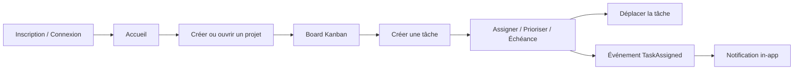
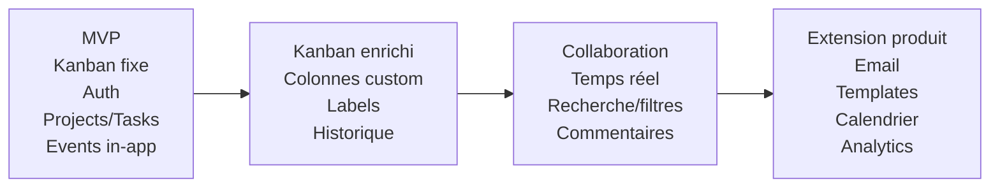

# kanban-app — Cahier des charges produit

**Version :** 1.0.0  
**Statut :** Référence  
**Date :** 2026-09-01  
**Langue de référence :** anglais  
**Durée du projet :** 3 semaines  
**Équipe :** 6 développeurs

---

## 1. Objectif

`kanban-app` est la refonte d'une application TodoList existante vers une application Kanban propre, maintenable et évolutive.

Le projet n'est pas un simple ajout de fonctionnalités. Il doit démontrer la capacité de l'équipe à :

- comprendre et évaluer une base de code existante ;
- identifier et réduire la dette technique ;
- établir une architecture maintenable ;
- livrer des améliorations de manière incrémentale ;
- mettre en place une authentification sécurisée et une gestion utilisateur compatible GDPR/RGPD ;
- introduire un workflow event-driven démontrable ;
- imposer des contrôles qualité automatisés ;
- produire des artefacts Docker ;
- conserver des traces professionnelles Git, Pull Request et Agile.

La qualité, la maintenabilité et la justification des décisions techniques priment sur le nombre de fonctionnalités.

---

## 2. Vision produit

Le produit cible est une application Kanban collaborative légère permettant à des utilisateurs authentifiés de créer des projets, inviter des membres, créer et assigner des tâches, déplacer les tâches dans un workflow Kanban fixe, gérer priorités et échéances, et recevoir des notifications internes.

Le produit initial reste volontairement réduit. L'architecture doit permettre des évolutions futures sans imposer immédiatement des microservices.

### Principes produit

1. **D'abord un workflow cœur simple.**
2. **Sécurisé par défaut.**
3. **Frontières de modules fortes.**
4. **Qualité automatisée avant les fonctionnalités optionnelles.**
5. **Petites Pull Requests et livraisons incrémentales.**
6. **Évolutivité future sans complexité distribuée prématurée.**
7. **Interface disponible en anglais et en français.**

---

## 3. Périmètre produit

### 3.1 Parcours principal



### 3.2 Écrans principaux

- Inscription
- Connexion
- Accueil personnel / liste de projets
- Board Kanban d'un projet
- Membres du projet
- Paramètres du projet
- Création/édition/détail d'une tâche
- Notifications
- Profil utilisateur
- Contrôles RGPD / export des données / suppression du compte

### 3.3 Langues

L'interface doit supporter :

- anglais (`en`)
- français (`fr`)

La langue choisie est stockée dans le profil de l'utilisateur connecté et peut être initialisée depuis la langue du navigateur.

---

## 4. Rôles et permissions

Le MVP utilise deux rôles projet.

| Capacité | Owner | Member |
|---|:---:|:---:|
| Voir le projet | Oui | Oui |
| Voir les membres | Oui | Oui |
| Créer une tâche | Oui | Oui |
| Modifier les tâches autorisées | Oui | Oui |
| Déplacer une tâche | Oui | Oui |
| Assigner une tâche à un membre | Oui | Oui |
| Modifier le projet | Oui | Non |
| Gérer les membres | Oui | Non |
| Supprimer le projet | Oui | Non |

Un projet possède exactement un Owner et zéro ou plusieurs Members.

Les rôles avancés/personnalisables sont hors MVP.

---

## 5. Modèle métier principal

### 5.1 User

- `id`
- `email`
- `passwordHash`
- `locale`
- `createdAt`
- `updatedAt`
- métadonnées de suppression/anonymisation si nécessaires

### 5.2 Project

- `id`
- `name`
- `description`
- `ownerId`
- `createdAt`
- `updatedAt`

### 5.3 ProjectMember

- `projectId`
- `userId`
- `role`
- `createdAt`

### 5.4 Task

- `id`
- `title`
- `description`
- `status`
- `priority`
- `deadline`
- `assigneeId`
- `projectId`
- `createdBy`
- `createdAt`
- `updatedAt`

### 5.5 Notification

- `id`
- `userId`
- `type`
- `payload`
- `readAt`
- `createdAt`

---

## 6. Workflow Kanban

Le MVP utilise des colonnes fixes :

```text
TODO → IN_PROGRESS → DONE
```

Les tâches sont déplacées par drag-and-drop et le nouvel état est persisté via l'API.

Les colonnes personnalisables ne sont pas requises pour le MVP et sont classées **Could Have**.

---

## 7. Priorités des tâches

```text
LOW
MEDIUM
HIGH
URGENT
```

Une échéance est optionnelle. Lorsqu'elle existe, elle est stockée sous forme d'horodatage normalisé et affichée selon la locale de l'utilisateur.

---

## 8. Authentification et compte

L'application doit fournir :

- inscription email/mot de passe ;
- connexion ;
- déconnexion ;
- renouvellement de session/access token ;
- validation de session ;
- modification du profil ;
- suppression du compte ;
- export des données personnelles.

OAuth n'appartient pas au MVP.

Les mots de passe ne doivent jamais être stockés en clair.

---

## 9. Gestion RGPD

L'utilisateur doit pouvoir :

1. consulter ses données ;
2. modifier ses données ;
3. exporter ses données ;
4. supprimer son compte.

Le comportement de suppression doit être documenté. Les données nécessaires à l'intégrité d'un projet qui ne peuvent pas être supprimées doivent être anonymisées et ne plus identifier directement l'utilisateur.

Le système ne doit collecter que les données personnelles nécessaires.

---

## 10. Projets

Opérations requises :

- créer un projet ;
- lister les projets accessibles ;
- consulter un projet ;
- modifier un projet ;
- supprimer un projet ;
- ajouter un membre ;
- retirer un membre ;
- lister les membres.

L'autorisation est contrôlée côté serveur.

---

## 11. Tâches

Opérations requises :

- créer une tâche ;
- lister les tâches d'un projet ;
- consulter une tâche ;
- modifier une tâche ;
- supprimer une tâche ;
- assigner/désassigner ;
- changer le statut ;
- changer la priorité ;
- définir/retirer l'échéance.

Le backend reste l'autorité pour les permissions et la validation de l'état.

---

## 12. Notifications

### MVP / Should Have

Les notifications sont **uniquement in-app**.

Workflow event-driven principal :

```text
Tâche assignée
    ↓
task.assigned.v1
    ↓
RabbitMQ
    ↓
Notification handler
    ↓
Notification persistée
    ↓
Notification visible
```

Types candidats :

- tâche assignée ;
- membre ajouté au projet ;
- échéance modifiée ;
- rappel d'échéance optionnel si un scheduler fiable est mis en place.

### Futur

Les notifications email sont prévues mais ne font pas partie du cœur de la livraison.

---

## 13. Référence MoSCoW

Les priorités imposées par le sujet restent prioritaires. Les améliorations internes ne doivent pas les dégrader.

### Must Have

- authentification sécurisée ;
- gestion utilisateur compatible RGPD ;
- CRUD Project ;
- CRUD Task ;
- Kanban basique avec colonnes fixes ;
- pipeline CI complet ;
- publication d'image Docker ;
- au moins un workflow event-driven complet et démontrable ;
- architecture cible maintenable mise en place tôt ;
- miroir vers le dépôt Epitech après validation réussie de `main`.

### Should Have

- notifications in-app ;
- priorités ;
- échéances ;
- accueil personnalisé ;
- quality gate bloquante ;
- interface bilingue EN/FR, car elle fait partie de la baseline produit choisie.

### Could Have

Demandes du sujet :

- fermeture automatique d'un projet ;
- Continuous Delivery complet ;
- contract testing.

Améliorations prioritaires de l'équipe après MVP :

1. colonnes Kanban personnalisables ;
2. labels/tags ;
3. board collaboratif temps réel ;
4. historique des tâches ;
5. recherche et filtres ;
6. commentaires ;
7. pièces jointes ;
8. scheduler/rappels d'échéance si non réalisés.

### Would Have / Futur

- notifications email ;
- rôles avancés ;
- templates de projet ;
- tâches récurrentes ;
- vue calendrier ;
- analytics ;
- audit avancé ;
- intégrations externes.

---

## 14. UX

Le board Kanban est l'interface principale.

Comportements minimum :

- tâches regroupées clairement par statut ;
- titre et informations utiles de priorité/échéance visibles ;
- drag-and-drop pour changer le statut ;
- erreurs de mutation visibles ;
- états de chargement et listes vides explicites ;
- confirmation des actions destructrices ;
- distinction des notifications non lues ;
- interface exploitable en anglais et en français.

La synchronisation temps réel entre plusieurs utilisateurs n'est pas requise pour le MVP. Après une mutation réussie, l'état local est mis à jour et/ou les données de référence sont rechargées.

---

## 15. Exigences non fonctionnelles

### Maintenabilité

- structure modulaire ;
- TypeScript strict ;
- dépendances explicites ;
- pas de logique métier cachée dans les controllers ou composants UI ;
- documentation mise à jour avec les décisions structurantes.

### Testabilité

- tests unitaires sur le métier ;
- tests d'intégration sur API/base de données ;
- tests E2E ciblés sur les parcours critiques si pertinents.

### Sécurité

- hash des mots de passe ;
- gestion sûre des sessions/tokens ;
- autorisation côté serveur ;
- validation des entrées ;
- CORS restreint ;
- rate limiting sur l'authentification ;
- secrets hors du dépôt ;
- security headers ;
- aucune valeur sensible dans les logs.

### Qualité

- lint ;
- vérification du format ;
- type check ;
- tests ;
- seuils de coverage ;
- quality gate bloquante ;
- build ;
- build Docker.

### Déploiement

L'application locale complète doit démarrer via un outillage Docker documenté. Le déploiement public reste optionnel en Sprint 3.

---

## 16. Acceptation du MVP

Un évaluateur doit pouvoir démontrer :

1. inscription et connexion ;
2. création de projet ;
3. ajout d'un membre ;
4. création d'une tâche ;
5. priorité et échéance ;
6. assignation ;
7. publication et consommation d'un événement ;
8. réception d'une notification in-app ;
9. déplacement drag-and-drop ;
10. blocage des opérations interdites ;
11. contrôles RGPD ;
12. CI verte ;
13. quality gate et coverage conformes ;
14. image Docker publiée ;
15. synchronisation du dépôt Epitech après un merge `main` validé.

---

## 17. Hors périmètre explicite du MVP

- microservices ;
- Kubernetes ;
- scaling horizontal ;
- cache Redis ;
- une base par module ;
- moteur complexe d'autorisations ;
- collaboration temps réel complète ;
- application mobile native ;
- emails ;
- analytics complexes ;
- stockage avancé de pièces jointes.

---

## 18. Roadmap



---

## 19. Politique de modification

Toute modification touchant les Must/Should, les contrats API publics, la sécurité, les événements, l'ownership des données, les quality gates ou les frontières de modules doit être reportée dans la documentation avant d'être considérée comme terminée.
