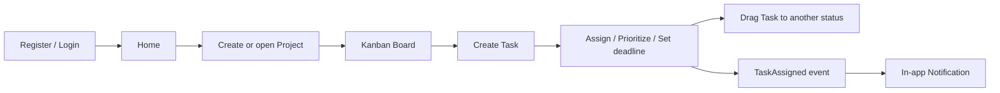
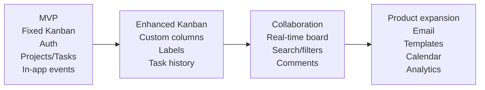

# kanban-app — Project Specification

**Version:** 1.0.0  
**Status:** Baseline  
**Date:** 2026-09-01  
**Reference language:** English  
**Project duration:** 3 weeks  
**Team size:** 6 developers

---

## 1. Purpose

`kanban-app` is the rework of an existing TodoList application into a clean, maintainable and evolvable Kanban project-management application.

The project is not a greenfield feature exercise. Its purpose is to demonstrate that the team can:

- understand and assess an existing codebase;
- identify and reduce technical debt;
- establish a maintainable architecture;
- deliver functional improvements incrementally;
- implement secure authentication and GDPR-compatible user management;
- introduce a demonstrable event-driven workflow;
- enforce automated quality checks;
- produce Docker artifacts;
- maintain professional Git, Pull Request and Agile evidence.

Quality, maintainability and demonstrable engineering decisions take priority over feature count.

---

## 2. Product vision

The target product is a lightweight collaborative Kanban application where authenticated users can create projects, invite members, create and assign tasks, move tasks across a fixed Kanban workflow, manage priorities and deadlines, and receive in-app notifications.

The initial product remains intentionally small. The architecture must make future improvements possible without requiring an immediate migration to microservices.

### Product principles

1. **Simple core workflow first.**
2. **Secure by default.**
3. **Strong module boundaries.**
4. **Automated quality before optional features.**
5. **Small Pull Requests and incremental delivery.**
6. **Future extensibility without premature distributed complexity.**
7. **English and French user interface support.**

---

## 3. Product scope

### 3.1 Core user journey



### 3.2 Main screens

- Register
- Login
- Personal home / project list
- Project Kanban board
- Project members
- Project settings
- Task create/edit/details
- Notifications
- User profile
- GDPR controls / data export / account deletion

### 3.3 Languages

The application UI must support:

- English (`en`)
- French (`fr`)

The selected locale is stored in the user profile when authenticated and may be initialized from the browser locale.

---

## 4. User roles and permissions

The MVP uses two project roles.

| Capability | Owner | Member |
|---|:---:|:---:|
| View project | Yes | Yes |
| View project members | Yes | Yes |
| Create task | Yes | Yes |
| Edit permitted tasks | Yes | Yes |
| Move task | Yes | Yes |
| Assign task to a project member | Yes | Yes |
| Edit project metadata | Yes | No |
| Manage project members | Yes | No |
| Delete project | Yes | No |

A project has exactly one Owner and zero or more Members.

Advanced/custom roles are outside the MVP.

---

## 5. Core domain model

### 5.1 User

Required attributes:

- `id`
- `email`
- `passwordHash`
- `locale`
- `createdAt`
- `updatedAt`
- account deletion/anonymisation metadata as required by the chosen GDPR implementation

### 5.2 Project

Required attributes:

- `id`
- `name`
- `description`
- `ownerId`
- `createdAt`
- `updatedAt`

### 5.3 ProjectMember

Required attributes:

- `projectId`
- `userId`
- `role`
- `createdAt`

### 5.4 Task

Required attributes:

- `id`
- `title`
- `description`
- `status`
- `priority`
- `deadline`
- `assigneeId`
- `projectId`
- `createdBy`
- `createdAt`
- `updatedAt`

### 5.5 Notification

Required attributes:

- `id`
- `userId`
- `type`
- `payload`
- `readAt`
- `createdAt`

---

## 6. Kanban workflow

The MVP uses fixed columns:

```text
TODO → IN_PROGRESS → DONE
```

Tasks are moved by drag-and-drop and the resulting state is persisted through the API.

Custom Kanban columns are not required for the MVP and are classified as **Could Have**.

---

## 7. Task priority

Supported priorities:

```text
LOW
MEDIUM
HIGH
URGENT
```

A deadline is optional but, when present, must use a normalized timestamp and be displayed in the user's locale.

---

## 8. Authentication and account management

The application must provide:

- registration by email/password;
- login;
- logout;
- access-token renewal;
- authenticated session validation;
- profile update;
- account deletion;
- personal-data export.

OAuth providers are not part of the MVP.

Passwords must never be stored in plaintext.

---

## 9. GDPR-compatible user management

The target user controls are:

1. view personal data;
2. update personal data;
3. export personal data;
4. delete the account.

Deletion behavior must be explicitly documented. Data that cannot be safely deleted because it is required to preserve project integrity must be anonymised rather than kept as directly identifying user data.

The system must avoid collecting personal data that is not necessary for the application.

---

## 10. Projects

Required project operations:

- create project;
- list projects accessible to the current user;
- get project details;
- update project metadata;
- delete project;
- add a project member;
- remove a project member;
- list members.

Authorization must be enforced server-side.

---

## 11. Tasks

Required task operations:

- create task;
- list project tasks;
- get task;
- update task;
- delete task;
- assign/unassign task;
- change status;
- change priority;
- set/remove deadline.

The backend remains authoritative for permission and state validation.

---

## 12. Notifications

### MVP / Should Have

Notifications are **in-app only**.

The main demonstrable event-driven workflow is:

```text
Task assigned
    ↓
task.assigned.v1
    ↓
RabbitMQ
    ↓
Notification handler
    ↓
Notification persisted
    ↓
User sees notification
```

Candidate in-app notification types:

- task assigned;
- project member added;
- task deadline changed;
- optional deadline approaching notification if scheduling is implemented safely.

### Future

Email notifications are explicitly planned but not part of the core delivery.

---

## 13. MoSCoW baseline

The school's mandatory priorities remain authoritative. Internal enhancements are added without downgrading school requirements.

### Must Have

- secure authentication;
- GDPR-compatible user management;
- Project CRUD;
- Task CRUD;
- basic fixed-column Kanban workflow;
- complete CI pipeline;
- Docker image publication;
- at least one complete demonstrable event-driven workflow;
- maintainable target architecture established early;
- repository mirroring to the Epitech endpoint after successful validation of `main`.

### Should Have

- in-app notifications;
- task priorities;
- task deadlines;
- personalized home screen;
- blocking code-quality gate;
- bilingual UI (EN/FR), because it is part of the product baseline chosen by the team.

### Could Have

School-specified:

- automatic project closure;
- complete Continuous Delivery;
- contract testing between components.

Team-prioritized enhancements after MVP:

1. custom Kanban columns;
2. labels/tags;
3. real-time collaborative board;
4. task history/audit view;
5. search and filters;
6. comments;
7. attachments;
8. deadline scheduler/reminders if not already delivered.

### Would Have / Future

- email notifications;
- advanced project roles and permissions;
- project templates;
- recurring tasks;
- calendar view;
- analytics;
- advanced audit features;
- external integrations.

---

## 14. UX requirements

The Kanban board is the main product surface.

Minimum behavior:

- tasks are clearly grouped by status;
- task cards display title and relevant priority/deadline information;
- drag-and-drop changes status;
- mutation failures are visible and do not silently desynchronize the UI;
- loading and empty states are explicit;
- destructive actions require clear confirmation;
- unread notifications are visually distinguishable;
- the interface remains usable in both English and French.

Real-time synchronization between different users is not required for the MVP. After a successful mutation, the local state is updated and/or authoritative data is refetched.

---

## 15. Non-functional requirements

### Maintainability

- modular structure;
- strict TypeScript;
- explicit dependency direction;
- no business logic hidden in controllers or UI components;
- documentation updated with architectural changes.

### Testability

- business logic has unit tests;
- API/database boundaries have integration tests;
- critical user journeys have targeted end-to-end coverage where valuable.

### Security

- password hashing;
- secure session/token handling;
- server-side authorization;
- input validation;
- safe CORS policy;
- rate limiting for authentication endpoints;
- secrets outside source control;
- security headers;
- no sensitive values in logs.

### Quality

- lint;
- formatting check;
- type check;
- tests;
- coverage thresholds;
- blocking quality gate;
- build validation;
- Docker build validation.

### Deployment

The complete local application must start from documented Docker tooling. Public deployment is optional for Sprint 3.

---

## 16. MVP acceptance

The MVP is considered coherent when a reviewer can demonstrate, end-to-end:

1. a user registers and authenticates;
2. a user creates a project;
3. a project owner adds another user as member;
4. a user creates a task;
5. the task receives priority/deadline data;
6. a task is assigned;
7. an event is published and consumed;
8. the assignee receives an in-app notification;
9. a task is moved across the Kanban board through drag-and-drop;
10. authorization prevents forbidden project operations;
11. GDPR profile/export/deletion controls are demonstrable;
12. the CI pipeline is green;
13. code quality and coverage gates pass;
14. the required Docker image is published;
15. after a validated merge to `main`, the required repository state is synchronized to the Epitech endpoint.

---

## 17. Explicit non-goals for the three-week MVP

- microservices;
- Kubernetes;
- horizontal scaling;
- Redis cache;
- multiple databases per module;
- customizable authorization engine;
- fully real-time collaboration;
- mobile-native applications;
- email notification delivery;
- complex analytics;
- rich attachment storage.

These are not forbidden future directions; they are intentionally excluded from the first delivery to protect quality and schedule.

---

## 18. Product roadmap



---

## 19. Change policy

Any change that affects Must/Should scope, public API contracts, security, event contracts, data ownership, CI gates or module boundaries must be reflected in the repository documentation before the change is considered complete.
