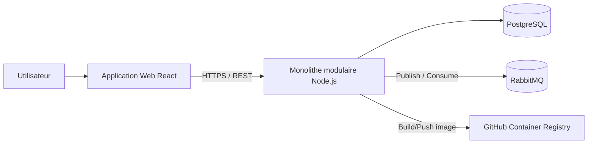
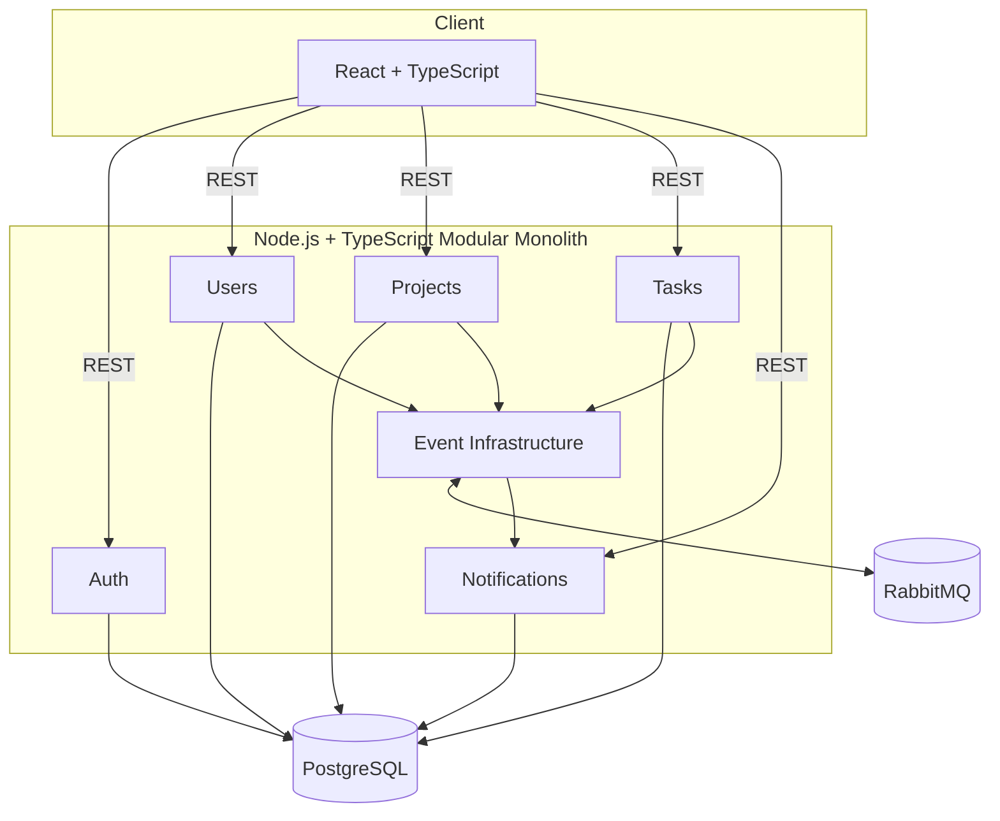
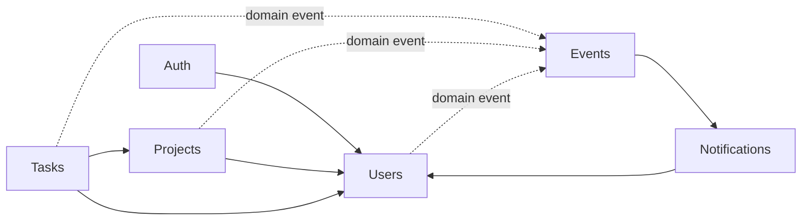
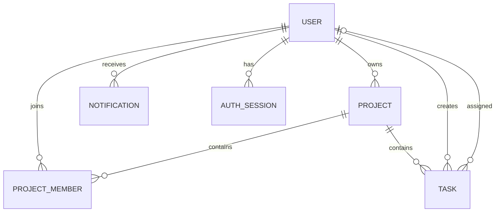
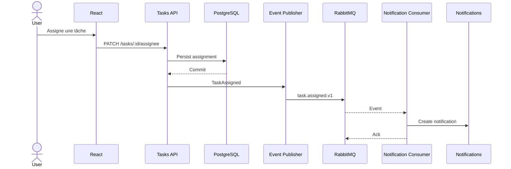
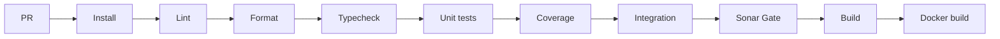
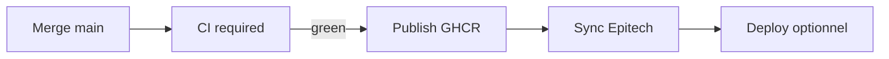
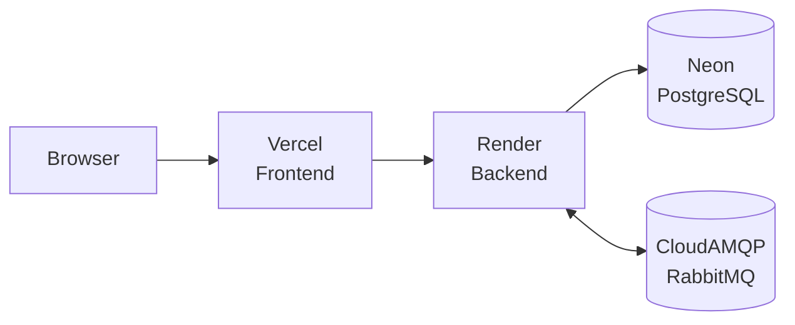
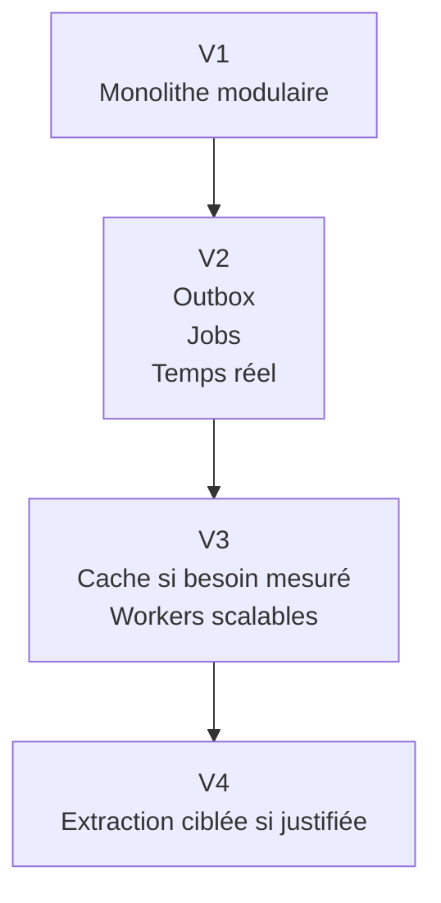

# kanban-app — Architecture technique

**Version :** 1.0.0  
**Statut :** Baseline de l'architecture cible  
**Date :** 2026-09-01

---

## 1. Décision d'architecture

La cible est un **monolithe modulaire avec intégration event-driven**.

L'application est déployée comme un seul backend pendant le projet, mais ce backend est séparé en modules métier explicites. Les workflows asynchrones passent par RabbitMQ.

### Raisons

Cette architecture apporte :

- séparation claire des responsabilités ;
- ownership des données par module ;
- logique métier testable ;
- développement et déploiement simples ;
- une base transactionnelle unique ;
- communication asynchrone démontrable ;
- faible complexité opérationnelle pour 5–6 personnes sur 3 semaines ;
- possibilité d'extraire plus tard certains modules si un besoin réel apparaît.

Les microservices sont volontairement exclus du MVP : ils ajouteraient des problématiques réseau, observabilité distribuée, transactions distribuées, multiplication des déploiements et gestion de contrats sans besoin démontré.

---

## 2. Contexte système



---

## 3. Architecture des composants



---

## 4. Baseline technologique

Les technologies choisies par l'équipe sont pertinentes pour l'évaluation et sont conservées.

| Zone | Décision | Remarque |
|---|---|---|
| Frontend | React + TypeScript | Adapté à un Kanban interactif |
| Build frontend | Vite | Recommandé sauf si le repo existant possède déjà un build viable |
| Routing | React Router | Routing SPA léger |
| i18n | `react-i18next` | UI EN/FR |
| Runtime backend | Node.js 24 LTS | Baseline LTS actuelle à la date du document |
| Langage backend | TypeScript strict | Langage commun client/serveur |
| Couche HTTP | Conserver le framework Node existant s'il est viable ; sinon Express 5 | Évite une migration sans valeur d'évaluation |
| Base | PostgreSQL | Adapté aux relations users/projects/tasks/members |
| Cible locale PostgreSQL | PostgreSQL 18.x | Version majeure supportée actuelle ; conserver une version supportée existante si nécessaire |
| ORM | Prisma ORM 7.x | Migrations + accès typé |
| Broker | RabbitMQ | Messagerie event-driven |
| Conteneurs | Docker + Docker Compose | Environnement reproductible + image requise |
| CI/CD | GitHub Actions | Automatisation native GitHub |
| Registry | GHCR | GitHub Container Registry |
| Qualité | ESLint + Prettier + TypeScript + SonarCloud | Responsabilités distinctes |
| Tests | Vitest | Tests TS rapides |
| Front tests | React Testing Library | Comportement composants |
| API tests | Supertest si Express | Intégration HTTP |
| E2E | Playwright ciblé | Parcours critiques uniquement |

### Politique de versions

- versions exactes verrouillées dans le lockfile ;
- runtimes supportés/LTS ;
- pas d'upgrade majeure pendant Sprint 3 sauf blocage ;
- conserver un framework supporté existant si son remplacement n'apporte aucune valeur architecturale.

---

## 5. Drag-and-drop

React DnD peut être utilisé **uniquement après un spike Sprint 1 validant la compatibilité avec la version React réelle du dépôt**.

Règle :

```text
React actuel + smoke tests React DnD OK
    → React DnD accepté

Problème React 19 / types / runtime
    → dnd-kit
```

`dnd-kit` est le fallback recommandé car son développement est actif et il fournit des primitives React/sortables actuelles.

Les détails de la librairie DnD restent enfermés dans la feature `kanban`.

---

## 6. Modules backend



### Auth

- register ;
- login ;
- logout ;
- refresh ;
- hash mot de passe ;
- validation session/token.

### Users

- profil ;
- locale ;
- export RGPD ;
- suppression/anonymisation.

### Projects

- CRUD Project ;
- ownership ;
- membres ;
- règles d'autorisation projet.

### Tasks

- CRUD Task ;
- assignation ;
- transitions de statut ;
- priorité ;
- échéance ;
- événements métier.

### Notifications

- persistance ;
- liste utilisateur ;
- read/read-all ;
- consommation d'événements.

### Event Infrastructure

- enveloppes ;
- connexion RabbitMQ ;
- publishers/consumers ;
- retry/erreurs ;
- arrêt propre.

---

## 7. Couches internes des modules

```text
module/
├── domain/
├── application/
├── infrastructure/
└── presentation/
```

Dépendances :

```text
presentation ─┐
              ├─> application ─> domain
infrastructure┘
```

Le domain n'importe ni Express, ni Prisma, ni RabbitMQ, ni React.

---

## 8. Structure du repository

```text
/
├── frontend/
│   └── src/
│       ├── app/
│       ├── features/
│       │   ├── auth/
│       │   ├── projects/
│       │   ├── kanban/
│       │   ├── tasks/
│       │   ├── notifications/
│       │   └── profile/
│       ├── shared/
│       └── i18n/
├── backend/
│   ├── src/
│   │   ├── modules/
│   │   │   ├── auth/
│   │   │   ├── users/
│   │   │   ├── projects/
│   │   │   ├── tasks/
│   │   │   └── notifications/
│   │   ├── shared/
│   │   └── main.ts
│   └── prisma/
├── docs/
├── .github/workflows/
├── docker-compose.yml
└── README.md
```

La migration depuis le legacy doit rester incrémentale. Pas de réécriture complète uniquement pour reproduire cette arborescence.

---

## 9. Ownership des données

Une seule base PostgreSQL.

| Module | Données |
|---|---|
| Users | `users` |
| Auth | sessions/refresh |
| Projects | `projects`, `project_members` |
| Tasks | `tasks` |
| Notifications | `notifications` |
| Events | `outbox_events`, `processed_events` optionnels |

---

## 10. Modèle de données



Le schéma Prisma final est la référence d'implémentation.

---

## 11. API REST

Préfixe :

```text
/api/v1
```

### Auth

```text
POST /auth/register
POST /auth/login
POST /auth/refresh
POST /auth/logout
```

### User / RGPD

```text
GET    /users/me
PATCH  /users/me
GET    /users/me/export
DELETE /users/me
```

### Projects

```text
GET    /projects
POST   /projects
GET    /projects/:projectId
PATCH  /projects/:projectId
DELETE /projects/:projectId
GET    /projects/:projectId/members
POST   /projects/:projectId/members
DELETE /projects/:projectId/members/:userId
```

### Tasks

```text
GET    /projects/:projectId/tasks
POST   /projects/:projectId/tasks
GET    /tasks/:taskId
PATCH  /tasks/:taskId
DELETE /tasks/:taskId
PATCH  /tasks/:taskId/status
PATCH  /tasks/:taskId/assignee
```

### Notifications

```text
GET   /notifications
PATCH /notifications/:notificationId/read
PATCH /notifications/read-all
```

### Ops

```text
GET /health
GET /ready
```

---

## 12. Event-driven



Enveloppe :

```json
{
  "id": "uuid",
  "type": "task.assigned",
  "version": 1,
  "occurredAt": "ISO-8601 timestamp",
  "correlationId": "uuid",
  "payload": {}
}
```

Durcissement futur :

1. consumers idempotents ;
2. retry/dead-letter ;
3. transactional outbox.

---

## 13. RabbitMQ

Exchange suggéré :

```text
kanban.events
```

Routing keys :

```text
task.assigned.v1
project.member_added.v1
user.deleted.v1
```

Queue :

```text
notifications.events.v1
```

Règles : ack explicite, pas de boucle infinie, aucun secret dans les messages, lifecycle propre.

---

## 14. Auth et sécurité

- Argon2id recommandé ;
- access token court ;
- refresh token avec rotation ;
- cookies `HttpOnly`, `Secure` en HTTPS ;
- stratégie `SameSite` cohérente ;
- hash de session/refresh côté serveur ;
- CSRF si cookies cross-origin ;
- validation de toutes les entrées ;
- autorisation serveur ;
- rate limiting auth ;
- CORS allowlist ;
- security headers ;
- secrets hors Git ;
- logs sans données sensibles.

---

## 15. RGPD

`GET /users/me/export` fournit un export machine-readable documenté.

`DELETE /users/me` :

1. authentifie ;
2. révoque les sessions ;
3. supprime les données supprimables ;
4. anonymise ce qui doit rester ;
5. émet `user.deleted.v1` si nécessaire ;
6. empêche toute nouvelle authentification.

---

## 16. Frontend

Structure par feature. Les appels API passent par un client partagé typé. Les composants UI n'utilisent pas les types Prisma directement. Les permissions UI ne remplacent jamais l'autorisation backend.

Le state management additionnel n'est ajouté que s'il existe un besoin réel.

---

## 17. Internationalisation

```text
react-i18next
locales/
├── en/
└── fr/
```

Le backend retourne de préférence des codes d'erreur stables ; le frontend traduit les messages utilisateur.

---

## 18. Tests

### Unitaires

- règles métier ;
- use cases ;
- permissions ;
- construction d'événements ;
- notifications.

### Intégration

- Prisma ;
- REST ;
- sessions ;
- contraintes PostgreSQL ;
- RabbitMQ.

### E2E ciblé

1. register/login ;
2. create/open project ;
3. create/assign/move task ;
4. notification visible.

---

## 19. Qualité

| Outil | Responsabilité |
|---|---|
| Prettier | format |
| ESLint | règles statiques |
| TypeScript strict | types |
| Vitest coverage | seuils |
| SonarCloud | quality gate global |

Seuils :

- global : **70 %** ;
- métier/domain : **80 %**.

Utiliser une configuration ESLint compatible Prettier pour éviter les règles contradictoires.

---

## 20. Docker local

```text
frontend
backend
postgres
rabbitmq
```

`.env.example` est versionné ; jamais les secrets réels.

---

## 21. CI

### Pull Request



### `main`



---

## 22. Miroir Epitech

Le repository de l'organisation est la source de développement. Le repository Epitech est l'endpoint.

Après merge sur `main` :

1. CI complète ;
2. publication Docker si verte ;
3. push de `main` et tags vers Epitech.

Préférer :

```text
git push epitech HEAD:main
git push epitech --tags
```

Éviter `git push --mirror` par défaut car il peut supprimer/écraser des refs non souhaitées.

Secret suggéré :

```text
EPITECH_MIRROR_SSH_KEY
```

---

## 23. Stratégie Git

Pas de branche `develop` long-lived.

```text
main
├── feature/S1-XX-description
├── fix/S1-XX-description
├── chore/S1-XX-description
└── docs/S1-XX-description
```

`main` protégée + CI + review suffit pour 3 semaines et simplifie le miroir.

Une branche d'intégration temporaire reste possible pour une migration risquée, mais ne devient pas la norme.

---

## 24. Déploiement Sprint 3 optionnel



Cette topologie vise une démonstration gratuite, pas une production avec SLA.

---

## 25. Observabilité

Minimum :

- logs structurés ;
- correlation ID requête/événement ;
- logs startup/shutdown ;
- `/health` ;
- `/ready` ;
- aucun token/mot de passe.

---

## 26. Évolution future



Ordre potentiel : worker notifications/events, gateway temps réel, puis uniquement les modules dont l'extraction est réellement justifiée.

---

## 27. Architecture Decision Log

| ID | Décision | Statut |
|---|---|---|
| ADR-001 | Monolithe modulaire | Accepté |
| ADR-002 | RabbitMQ | Accepté |
| ADR-003 | PostgreSQL + Prisma | Accepté |
| ADR-004 | REST | Accepté |
| ADR-005 | Notifications in-app | Accepté |
| ADR-006 | Colonnes fixes MVP | Accepté |
| ADR-007 | Pas de `develop` long-lived | Accepté |
| ADR-008 | Repo org → miroir Epitech | Accepté |
| ADR-009 | React DnD conditionnel au spike | Accepté |
| ADR-010 | Déploiement public optionnel Sprint 3 | Accepté |
| ADR-011 | UI EN/FR | Accepté |
| ADR-012 | Email prévu mais différé | Accepté |

---

## 28. Risques

| Risque | Réponse |
|---|---|
| Legacy difficile à modulariser | Refactor incrémental |
| React DnD incompatible | Spike + dnd-kit |
| RabbitMQ trop tard | Vertical slice Sprint 1 |
| Coverage trop tard | Gate Sprint 1 |
| Conflit outils qualité | Responsabilités séparées |
| Secret de miroir exposé | Secret Actions + SSH |
| Limites hébergeur gratuit | Déploiement public optionnel |
| Commit DB OK / publish event KO | retry + future outbox |
| Scope creep | MoSCoW + WIP |

---

## 29. Références techniques

- https://nodejs.org/en/about/previous-releases
- https://docs.prisma.io/docs/orm/reference/system-requirements
- https://www.postgresql.org/support/versioning/
- https://github.com/react-dnd/react-dnd
- https://dndkit.com/
- https://vercel.com/docs/plans/hobby
- https://render.com/docs/free
- https://neon.com/pricing
- https://www.cloudamqp.com/plans.html
