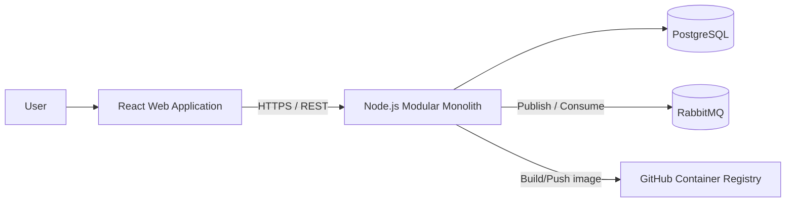
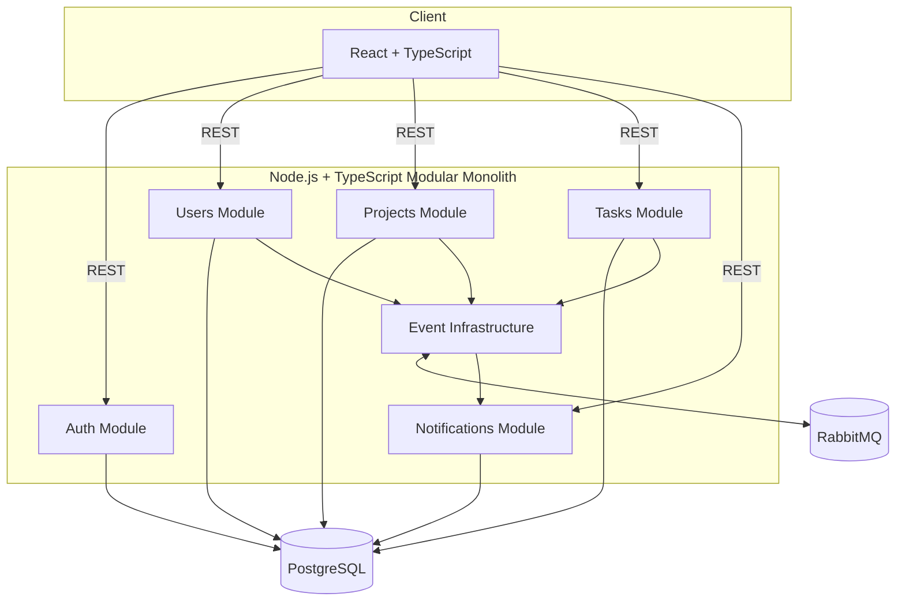
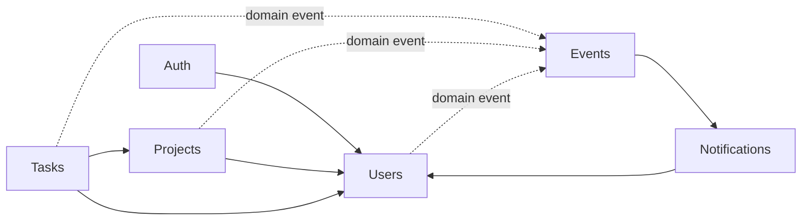
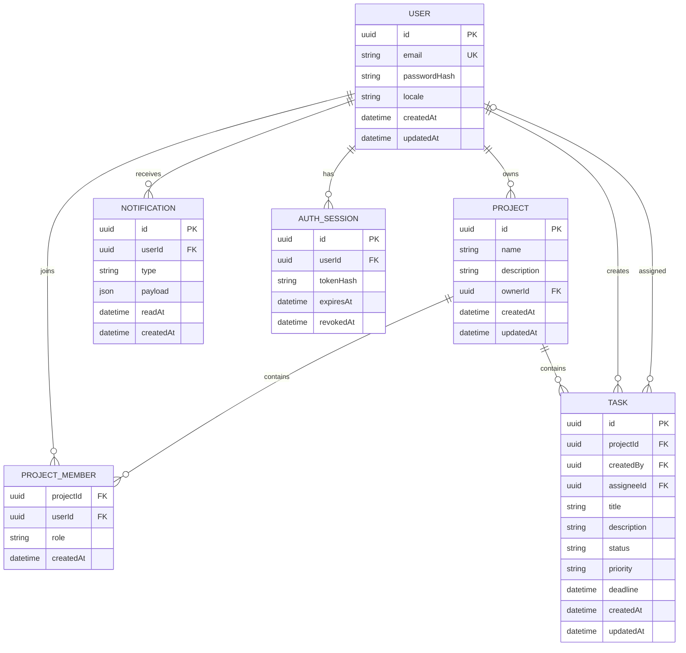
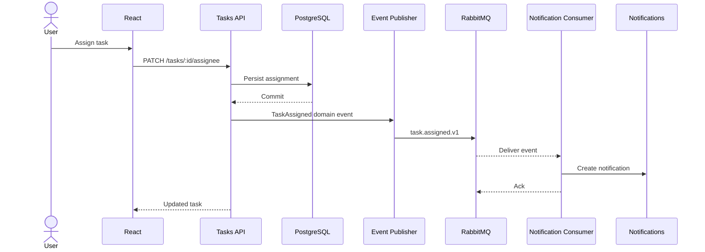
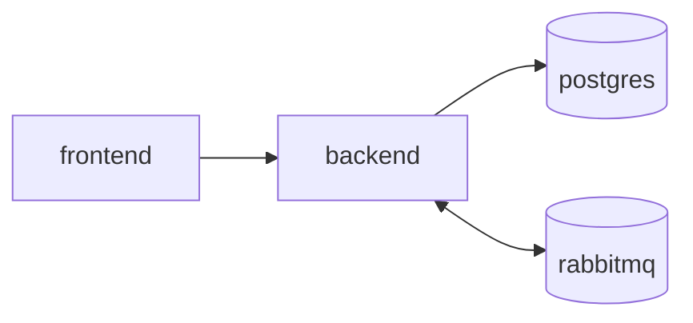
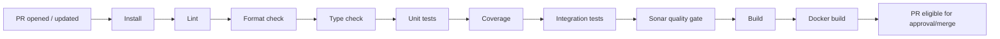
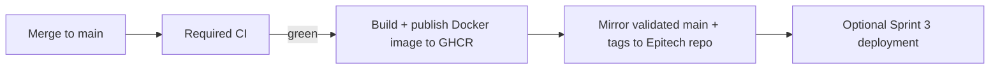
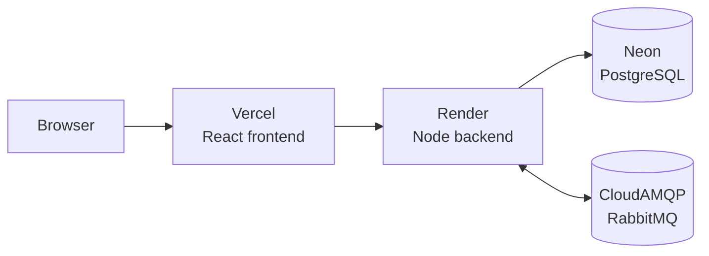
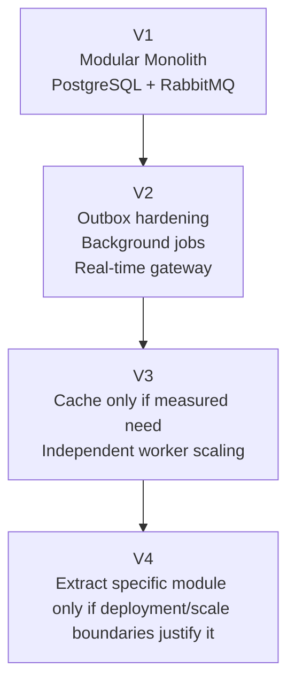

# kanban-app — Technical Architecture

**Version:** 1.0.0  
**Status:** Target architecture baseline  
**Date:** 2026-09-01

---

## 1. Architecture decision

The target is a **Modular Monolith with Event-Driven integration**.

The application is deployed as one backend application during the project, but the backend is split into explicit business modules. Asynchronous workflows use RabbitMQ.

### Why this architecture

It provides:

- clear separation of responsibilities;
- module-level data ownership;
- testable business logic;
- simple local development and deployment;
- a single transactional database;
- demonstrable asynchronous communication;
- low operational overhead for a 5–6 person / 3-week project;
- future extraction paths if a real scalability need appears.

Microservices are intentionally rejected for the MVP because they would introduce network failure modes, service discovery, distributed observability, distributed transactions, multiple deployments and contract-management overhead without a demonstrated need.

---

## 2. System context



---

## 3. Container architecture



---

## 4. Technology baseline

The technologies selected by the team are appropriate for the assignment and are retained.

| Area | Decision | Notes |
|---|---|---|
| Frontend | React + TypeScript | Appropriate for interactive Kanban UI |
| Frontend build | Vite | Recommended for a React SPA unless the existing repository already has a viable build system |
| Routing | React Router | Lightweight SPA routing |
| i18n | `react-i18next` | EN/FR UI |
| Backend runtime | Node.js 24 LTS | Current LTS baseline at document date |
| Backend language | TypeScript strict | Shared language across client/server |
| HTTP layer | Preserve viable existing Node framework; otherwise Express 5 | Avoid framework migration that brings no evaluation value |
| Database | PostgreSQL | Strong relational fit for users/projects/tasks/members |
| Local PostgreSQL target | PostgreSQL 18.x | Current supported major; preserve existing supported major if migration risk is unnecessary |
| ORM | Prisma ORM 7.x | Compatible with current Node LTS; migrations and type-safe data access |
| Broker | RabbitMQ | Durable event-driven messaging |
| Containerization | Docker + Docker Compose | Reproducible local environment and required image publication |
| CI/CD | GitHub Actions | Native repository automation |
| Image registry | GHCR | GitHub Container Registry |
| Quality | ESLint + Prettier + TypeScript + SonarCloud | Responsibilities kept separate |
| Unit/integration tests | Vitest | Fast TypeScript-native test runner |
| Frontend tests | React Testing Library | Component behavior |
| API tests | Supertest if Express is used | HTTP integration tests |
| E2E | Playwright, targeted | Critical user flow only |

### Version policy

- Pin exact dependency versions in the lockfile.
- Use supported LTS/runtime versions.
- Do not perform major dependency upgrades during Sprint 3 unless required to fix a blocking issue.
- Preserve an existing supported framework/version if replacing it has no architectural value.

---

## 5. Drag-and-drop decision

React DnD may be used **only after a Sprint 1 compatibility spike confirms that it works with the React version actually present in the repository**.

Reason: React DnD remains a valid drag-and-drop library, but React 19-specific issues have remained open in its public tracker. The Kanban feature must not become dependent on an unverified compatibility assumption.

Decision rule:

```text
Existing React version + React DnD smoke tests pass
    → React DnD accepted

React 19 compatibility/type/runtime issues appear
    → use dnd-kit
```

`dnd-kit` is the preferred fallback because it is actively developed and provides current React integration and sortable primitives.

The UI architecture must isolate the drag-and-drop library inside the Kanban feature so changing the library does not affect domain/API contracts.

---

## 6. Backend module model



### Modules

#### Auth

Responsibilities:

- register;
- login;
- logout;
- refresh session;
- password hashing;
- session/token validation.

Auth does not own project permissions.

#### Users

Responsibilities:

- user profile;
- locale;
- GDPR export;
- account deletion/anonymisation;
- user lookup required by project membership.

#### Projects

Responsibilities:

- Project CRUD;
- ownership;
- project membership;
- project-level authorization rules.

#### Tasks

Responsibilities:

- Task CRUD;
- assignment;
- status transitions;
- priorities;
- deadlines;
- task-related domain events.

#### Notifications

Responsibilities:

- persist notification;
- list current user's notifications;
- mark one/all as read;
- consume relevant events.

#### Event Infrastructure

Responsibilities:

- event envelope;
- RabbitMQ connection/channel lifecycle;
- publishers;
- consumers;
- retry/error handling;
- graceful shutdown.

---

## 7. Internal module layering

Each business module follows a pragmatic clean/hexagonal-inspired structure:

```text
module/
├── domain/
│   ├── entities/
│   ├── value-objects/
│   ├── errors/
│   └── repository-ports/
├── application/
│   ├── use-cases/
│   ├── dto/
│   └── ports/
├── infrastructure/
│   ├── persistence/
│   └── messaging/
└── presentation/
    ├── controllers/
    ├── routes/
    └── schemas/
```

Dependency direction:

```text
presentation ─┐
              ├─> application ─> domain
infrastructure┘
```

The domain must not import Express, Prisma, RabbitMQ or React.

---

## 8. Repository layout

Recommended target layout:

```text
/
├── frontend/
│   ├── src/
│   │   ├── app/
│   │   ├── features/
│   │   │   ├── auth/
│   │   │   ├── projects/
│   │   │   ├── kanban/
│   │   │   ├── tasks/
│   │   │   ├── notifications/
│   │   │   └── profile/
│   │   ├── shared/
│   │   └── i18n/
│   └── ...
├── backend/
│   ├── src/
│   │   ├── modules/
│   │   │   ├── auth/
│   │   │   ├── users/
│   │   │   ├── projects/
│   │   │   ├── tasks/
│   │   │   └── notifications/
│   │   ├── shared/
│   │   │   ├── config/
│   │   │   ├── database/
│   │   │   ├── events/
│   │   │   ├── http/
│   │   │   └── security/
│   │   └── main.ts
│   └── prisma/
├── docs/
├── .github/workflows/
├── docker-compose.yml
└── README.md
```

If the provided repository layout differs, refactor incrementally. Do not perform a full rewrite solely to match folder names.

---

## 9. Data ownership

One PostgreSQL database is used.

Logical table ownership:

| Module | Owned data |
|---|---|
| Users | `users` |
| Auth | `auth_sessions` / refresh-session data |
| Projects | `projects`, `project_members` |
| Tasks | `tasks` |
| Notifications | `notifications` |
| Event infrastructure | optional `outbox_events`, `processed_events` if reliability hardening is implemented |

Modules must use application/domain interfaces rather than casually querying another module's table from arbitrary code.

---

## 10. Data model



Final Prisma field types and deletion behavior are defined by the schema and reviewed during implementation.

---

## 11. REST API baseline

Prefix:

```text
/api/v1
```

### Auth

```text
POST   /auth/register
POST   /auth/login
POST   /auth/refresh
POST   /auth/logout
```

### Current user / GDPR

```text
GET    /users/me
PATCH  /users/me
GET    /users/me/export
DELETE /users/me
```

### Projects

```text
GET    /projects
POST   /projects
GET    /projects/:projectId
PATCH  /projects/:projectId
DELETE /projects/:projectId

GET    /projects/:projectId/members
POST   /projects/:projectId/members
DELETE /projects/:projectId/members/:userId
```

### Tasks

```text
GET    /projects/:projectId/tasks
POST   /projects/:projectId/tasks

GET    /tasks/:taskId
PATCH  /tasks/:taskId
DELETE /tasks/:taskId
PATCH  /tasks/:taskId/status
PATCH  /tasks/:taskId/assignee
```

### Notifications

```text
GET    /notifications
PATCH  /notifications/:notificationId/read
PATCH  /notifications/read-all
```

### Operations

```text
GET /health
GET /ready
```

Use consistent error objects and status codes. Input validation occurs at the presentation boundary.

---

## 12. Event-driven architecture

### Demonstration workflow



### Event envelope

```json
{
  "id": "uuid",
  "type": "task.assigned",
  "version": 1,
  "occurredAt": "ISO-8601 timestamp",
  "correlationId": "uuid",
  "payload": {}
}
```

Contracts are versioned. Consumers do not depend on internal ORM objects.

### Delivery semantics

For Sprint 1, the system may publish after a successful database commit through an abstracted publisher.

Reliability hardening path:

1. idempotent consumers;
2. retry/dead-letter strategy;
3. transactional outbox if the team has enough time.

The outbox pattern is preferred before any future move to independently deployed services because it removes the database-commit/message-publish dual-write gap.

---

## 13. RabbitMQ conventions

Suggested exchange:

```text
kanban.events
```

Suggested topic routing keys:

```text
task.assigned.v1
project.member_added.v1
user.deleted.v1
```

Notification queue example:

```text
notifications.events.v1
```

Rules:

- durable production/demo queue configuration;
- explicit acknowledgements;
- nack/requeue only for retryable failure;
- malformed/non-retryable events must not loop forever;
- consumer startup/shutdown is tied to application lifecycle;
- message payloads must not include password/session secrets.

---

## 14. Authentication and security

### Passwords

Preferred password hashing: **Argon2id**.

### Session model

Recommended:

- short-lived access token;
- refresh token with rotation;
- tokens transported through `HttpOnly`, `Secure` cookies in deployed HTTPS environments;
- `SameSite` policy chosen consistently with frontend/backend domains;
- refresh-session/token hash stored server-side so sessions can be revoked.

If authentication cookies are used across origins, CSRF mitigation must be explicitly implemented and tested.

### Additional controls

- schema validation for all inputs;
- server-side authorization;
- unique normalized email;
- rate limit login/register/refresh endpoints;
- security headers;
- restrictive CORS allowlist;
- production secrets from environment/secret store;
- avoid sensitive values in logs;
- dependency vulnerability review in CI where practical.

---

## 15. GDPR implementation

`GET /users/me/export` returns the user's exportable personal data in a documented machine-readable format.

`DELETE /users/me` must:

1. verify authentication;
2. revoke active sessions;
3. delete data that can be deleted;
4. anonymise data that must remain for project integrity;
5. emit `user.deleted.v1` when downstream cleanup is required;
6. ensure the deleted user can no longer authenticate.

The exact legal interpretation is outside the scope of the school project; the implementation must nevertheless demonstrate privacy-oriented data control.

---

## 16. Frontend architecture

Feature-oriented structure:

```text
features/
├── auth
├── projects
├── kanban
├── tasks
├── notifications
└── profile
```

Rules:

- API calls go through a shared typed client;
- UI components do not directly know Prisma/database types;
- server data and local UI state are separated;
- drag-and-drop library details stay inside `kanban`;
- translation keys, not hard-coded bilingual conditions, drive i18n;
- permissions from the UI improve UX but do not replace backend authorization.

A lightweight server-state library may be used if already present. Do not add a state-management framework without an actual need.

---

## 17. Internationalization

Recommended frontend implementation:

```text
react-i18next
locales/
├── en/
└── fr/
```

Backend APIs return stable machine-readable error codes. User-facing translation is preferably handled in the frontend.

Locale-sensitive dates are formatted at the client boundary.

Future email notifications will have locale-specific templates.

---

## 18. Testing strategy

### Unit

Targets:

- domain rules;
- use cases;
- permission rules;
- event construction;
- notification behavior.

### Integration

Targets:

- Prisma repositories;
- REST endpoints;
- authentication/session behavior;
- PostgreSQL constraints;
- RabbitMQ publisher/consumer workflow.

CI may use service containers for PostgreSQL and RabbitMQ.

### E2E

Keep E2E small and high-value:

1. register/login;
2. create/open project;
3. create/assign/move task;
4. notification becomes visible.

---

## 19. Code quality

### Tool responsibility

| Tool | Responsibility |
|---|---|
| Prettier | formatting |
| ESLint | static code rules |
| TypeScript strict | type correctness |
| Vitest coverage | executable coverage thresholds |
| SonarCloud | consolidated quality gate / code smells / duplications / coverage ingestion |

Use an ESLint configuration compatible with Prettier to avoid duplicated/contradictory formatting rules.

### Coverage policy

Baseline:

- global project minimum: **70%**;
- business/domain logic target/minimum: **80%**.

Do not increase coverage with meaningless tests. Critical business rules take priority over raw percentage.

SonarCloud's blocking quality gate remains authoritative for issues it evaluates.

---

## 20. Local Docker architecture



Minimum Compose services:

```text
frontend
backend
postgres
rabbitmq
```

Local infrastructure must be reproducible from documented commands and environment templates.

Do not commit real `.env` secrets. Commit `.env.example`.

---

## 21. CI pipeline

### Pull Request



No failing mandatory job may be bypassed for a normal merge.

### Push to protected `main`



---

## 22. Epitech repository mirroring

The organization repository is the development source of truth. The Epitech repository is the required endpoint mirror.

Rules:

1. developers work only in the organization repository;
2. feature branches and Pull Requests are created there;
3. `main` is protected;
4. a merge to `main` triggers the required CI;
5. only a green pipeline may publish/synchronize;
6. the mirror job pushes the validated `main` history and tags to the Epitech remote;
7. mirror credentials are stored as GitHub Actions secrets;
8. credentials are never printed in logs;
9. mirroring failure makes the post-merge delivery workflow fail visibly.

Preferred safe synchronization:

```text
git push epitech HEAD:main
git push epitech --tags
```

A destructive `git push --mirror` is not the default because it can remove or overwrite refs unintentionally. Use it only if Epitech explicitly requires a full ref mirror.

Suggested secret:

```text
EPITECH_MIRROR_SSH_KEY
```

Host key pinning should be used for SSH.

---

## 23. Git branching strategy

Decision: **no long-lived `develop` branch for the three-week project**.

```text
main
├── feature/S1-XX-short-description
├── fix/S1-XX-short-description
├── chore/S1-XX-short-description
└── docs/S1-XX-short-description
```

Reason:

- `main` is already protected by CI + review;
- every change is incremental;
- an additional integration branch duplicates state;
- it delays feedback;
- it complicates the Epitech mirror path;
- three one-week sprints do not justify GitFlow overhead.

If a temporary integration branch is ever needed for a risky migration, it must be short-lived and explicitly documented; it does not become the normal workflow.

---

## 24. Optional Sprint 3 public deployment

Recommended free/demo topology, subject to provider limits at deployment time:



Why:

- Vercel is well suited to the React frontend;
- the Node backend and RabbitMQ consumer are better handled by a long-running web service than by relying on ephemeral serverless execution;
- Neon currently provides a free PostgreSQL tier without a fixed 30-day database expiry;
- CloudAMQP provides a free shared RabbitMQ development tier.

This is for demonstration, not a production SLA.

A public deployment remains **Could Have**. Docker/GHCR and CI remain mandatory even if no public hosting is delivered.

---

## 25. Observability

Minimum:

- structured backend logs;
- request correlation ID;
- event correlation ID;
- startup/shutdown logs;
- `/health`;
- `/ready`;
- no password/token values.

Future:

- metrics;
- distributed tracing;
- centralized logging.

---

## 26. Scalability and future architecture



Potential future extraction order:

1. notification/event worker;
2. real-time collaboration gateway;
3. other modules only after measured operational need.

Do not split Auth, Tasks, Projects and Notifications into microservices merely because the codebase grows.

---

## 27. Architecture Decision Log

| ID | Decision | Status | Rationale |
|---|---|---|---|
| ADR-001 | Modular Monolith | Accepted | Best complexity/maintainability trade-off for 3 weeks |
| ADR-002 | RabbitMQ for asynchronous events | Accepted | Explicit event-driven requirement and reliable queue semantics |
| ADR-003 | PostgreSQL + Prisma | Accepted | Relational domain and type-safe persistence |
| ADR-004 | REST API | Accepted | Simple synchronous CRUD boundary |
| ADR-005 | In-app notifications first | Accepted | Required value without email infrastructure |
| ADR-006 | Fixed Kanban columns for MVP | Accepted | Protects core scope; customization remains Could |
| ADR-007 | No long-lived `develop` | Accepted | CI-protected main is sufficient for short project |
| ADR-008 | Organization repo → Epitech validated mirror | Accepted | Organization repo is development source; Epitech is endpoint |
| ADR-009 | React DnD conditional on compatibility spike | Accepted | Avoid unresolved React-version risk |
| ADR-010 | Public hosting is Sprint 3 optional | Accepted | Docker publication is mandatory; CD is not |
| ADR-011 | EN/FR UI | Accepted | Team-selected product baseline |
| ADR-012 | Email notification architecture reserved, delivery deferred | Accepted | Avoids scope expansion while preserving evolution path |

---

## 28. Technical risks

| Risk | Mitigation |
|---|---|
| Legacy code resists modularization | Incremental strangler-style refactor; avoid full rewrite |
| React DnD incompatibility | Sprint 1 spike; switch to dnd-kit behind Kanban boundary |
| RabbitMQ integration delayed | Deliver one vertical event flow in Sprint 1 |
| Coverage added too late | Coverage gate introduced in Sprint 1 |
| Sonar/ESLint/Prettier conflict | Separate responsibilities and use compatible config |
| Mirror leaks credentials | SSH key in Actions secret, masked logs, pinned host |
| Free hosting sleeps/limits | Hosting remains optional; local Docker is authoritative |
| DB commit succeeds but message publish fails | Publisher abstraction; retries; outbox as hardening path |
| Scope creep | MoSCoW and WIP limits |

---

## 29. External technical references

Verified when this baseline was written:

- Node.js release status: https://nodejs.org/en/about/previous-releases
- Prisma system requirements: https://docs.prisma.io/docs/orm/reference/system-requirements
- PostgreSQL versioning: https://www.postgresql.org/support/versioning/
- React DnD repository: https://github.com/react-dnd/react-dnd
- dnd-kit: https://dndkit.com/
- Vercel Hobby: https://vercel.com/docs/plans/hobby
- Render free services: https://render.com/docs/free
- Neon pricing: https://neon.com/pricing
- CloudAMQP plans: https://www.cloudamqp.com/plans.html
