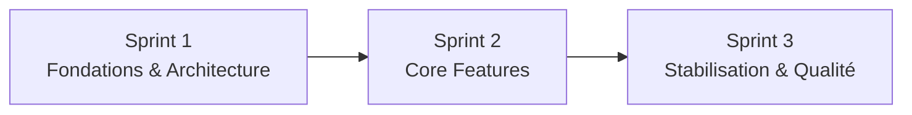

# kanban-app — Delivery & Gouvernance

**Version :** 1.0.0  
**Date :** 2026-09-01  
**Durée :** 3 sprints d'une semaine  
**Équipe :** 6 développeurs

---

## 1. Modèle de delivery

Le projet suit les pratiques Scrum imposées tout en utilisant un board de type Kanban pour visualiser le flux.

Cadence :

- Sprint Planning ;
- Daily ;
- Sprint Review ;
- Rétrospective ;
- Scrum Master tournant ;
- représentant Product Owner ;
- Product Backlog priorisé ;
- MoSCoW.

Le board visualise l'exécution mais ne remplace pas Scrum.

---

## 2. Sprints



### Sprint 1

- analyser le legacy ;
- documenter la dette ;
- conventions ;
- architecture modulaire ;
- vertical slice end-to-end ;
- event-driven démontrable ;
- CI/coverage/qualité ;
- Docker ;
- mécanisme miroir.

### Sprint 2

- auth/session ;
- Projects/Tasks ;
- Kanban ;
- RGPD ;
- notifications event-driven ;
- priorités/échéances/home ;
- tests intégration/E2E.

### Sprint 3

- régression/stabilité ;
- audit sécurité/RGPD ;
- robustesse events ;
- coverage ;
- Docker final ;
- documentation/demo ;
- déploiement public optionnel ;
- Could uniquement si Must/Should stables.

---

## 3. Workflow GitHub Project

```text
Backlog
  ↓
Ready
  ↓
In Progress
  ↓
In Review
  ↓
Testing
  ↓
Done
```

`Blocked` est utilisé explicitement lorsqu'une dépendance empêche l'avancement.

### Champs obligatoires

- Title
- Description
- Acceptance Criteria
- Assignee
- Type
- Priority
- Estimate
- Sprint / Iteration
- Area
- MoSCoW

### Estimate

```text
1 / 2 / 3 / 5 / 8
```

Pas de champ Size/Effort redondant.

### Areas

- Frontend Core
- Frontend Kanban
- Auth & Users
- Projects & Tasks / Domain
- Data & Events
- DevOps & QA

---

## 4. WIP

- un développeur possède normalement un seul item actif en `In Progress` ;
- review prioritaire avant de démarrer inutilement autre chose ;
- les items 8 points doivent être challengés et découpés si possible ;
- tout blocage affiche sa cause ;
- fonctionner localement ne suffit pas pour passer Done.

---

## 5. Branches

```text
feature/S1-XX-description
fix/S1-XX-description
chore/S1-XX-description
docs/S1-XX-description
test/S1-XX-description
```

`main` est la branche d'intégration protégée.

Pas de `develop` permanent pour ce projet de 3 semaines.

---

## 6. Pull Requests

Conditions minimum :

- issue liée ;
- scope ciblé ;
- description compréhensible ;
- critères d'acceptation couverts ;
- tests ;
- CI verte ;
- quality gate verte ;
- au moins une approbation ;
- aucun commentaire bloquant non résolu.

---

## 7. Definition of Done

Une User Story est Done uniquement si :

1. PR reviewée ;
2. au moins une approbation ;
3. tests métier adaptés ;
4. coverage conforme ;
5. quality gate bloquante conforme ;
6. CI complète verte ;
7. artefacts/build Docker produits ;
8. documentation à jour ;
9. démontrable en Sprint Review ;
10. issue liée à la PR ;
11. aucun défaut bloquant connu.

---

## 8. CI

### PR / push pertinent

- install ;
- lint ;
- Prettier check ;
- TypeScript ;
- tests unitaires ;
- coverage ;
- intégration ;
- SonarCloud ;
- build ;
- Docker build.

### `main` validée

- publication GHCR ;
- miroir `main` + tags vers Epitech ;
- déploiement optionnel.

Le miroir ne s'exécute jamais avant validation.

---

## 9. Gouvernance du miroir

Le repo de l'organisation est la source de vérité pour :

- développement ;
- PR ;
- GitHub Project ;
- CI ;
- qualité ;
- historique de collaboration.

Le repo Epitech est l'endpoint de livraison et ne doit pas recevoir de développements directs normaux.

---

## 10. Gouvernance qualité

- Prettier = format ;
- ESLint = règles statiques ;
- TypeScript strict = type safety ;
- SonarCloud = quality gate ;
- coverage global minimum 70 % ;
- métier/domain 80 %.

Pas de faux tests pour gonfler les pourcentages.

---

## 11. Documentation

Mettre à jour la documentation lors d'une modification de :

- architecture ;
- frontières de modules ;
- contrats API/events ;
- sécurité/session ;
- commandes environnement/déploiement ;
- CI ;
- MoSCoW ;
- décision importante de backlog.

Les fichiers anglais sont la référence ; les `.fr.md` sont leurs équivalents français.

---

## 12. Discipline de décision

Une décision importante contient :

- contexte ;
- décision ;
- alternatives ;
- raison ;
- conséquences ;
- statut.

La table ADR de l'architecture est la référence.

---

## 13. Preuves pour les reviews

### Review intermédiaire

- analyse legacy ;
- architecture ;
- vertical slice ;
- CI ;
- quality gate ;
- event-driven ;
- backlog ;
- conventions Git/PR ;
- exemple de cycle User Story.

### Review finale

- Must/Should ;
- tests/coverage ;
- quality gate ;
- CI/CD ;
- Docker ;
- miroir ;
- Git/PR ;
- Agile ;
- rétrospective ;
- documentation.

---

## 14. Ordre de démo recommandé

```text
1. Architecture
2. CI / qualité / Git
3. Register / login
4. Create project
5. Add member
6. Create task
7. Priority + deadline
8. Assign task
9. Event RabbitMQ
10. Notification
11. Drag Kanban
12. Permissions
13. RGPD
14. Docker/GHCR
15. Mirror Epitech
16. Déploiement/Could
```

---

## 15. Règle anti-scope-creep

Aucun Could ne démarre si :

- un Must est incomplet ;
- un Should important est instable ;
- CI rouge ;
- quality gate rouge ;
- workflow event-driven non démontrable ;
- Docker cassé ;
- défaut sécurité critique ouvert.

Priorité des Could équipe :

1. colonnes custom ;
2. labels/tags ;
3. historique tâche ;
4. collaboration temps réel ;
5. recherche/filtres ;
6. autres améliorations UX.

---

## 16. Freeze final

Autorisé :

- bugs ;
- tests ;
- sécurité ;
- docs ;
- qualité ;
- stabilisation demo/deploy.

À éviter :

- remplacement d'architecture ;
- upgrade majeure de dépendance ;
- grosse nouvelle feature optionnelle ;
- refactor massif sans gain direct.
