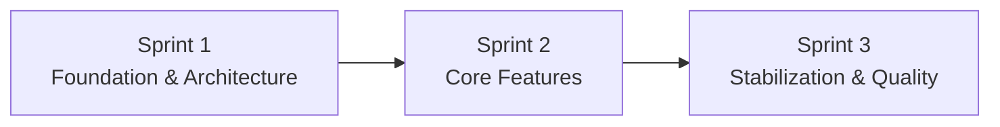

# kanban-app — Delivery & Governance

**Version:** 1.0.0  
**Date:** 2026-09-01  
**Duration:** 3 one-week sprints  
**Team:** 6 developers

---

## 1. Delivery model

The project follows the Scrum practices required by the assignment while using a Kanban-style board for flow visibility.

Cadence:

- Sprint Planning;
- Daily stand-up;
- Sprint Review;
- Retrospective;
- rotating Scrum Master;
- Product Owner representative;
- prioritized Product Backlog;
- MoSCoW prioritization.

The board visualizes execution; it does not replace Scrum.

---

## 2. Sprint structure



### Sprint 1 — Foundation & Architecture

Objectives:

- understand the legacy codebase;
- document technical debt;
- establish conventions;
- establish modular target architecture;
- create one end-to-end vertical application path;
- make the event-driven foundation demonstrable;
- establish CI, coverage and quality processes;
- establish Docker build;
- establish repository mirror mechanism.

### Sprint 2 — Core Features

Objectives:

- complete authentication/session flows;
- complete Project and Task capabilities;
- deliver usable Kanban board;
- deliver GDPR controls;
- deliver in-app event-driven notifications;
- integrate priority/deadline/home requirements;
- expand integration and E2E tests.

### Sprint 3 — Stabilization & Quality

Objectives:

- regression/stability;
- security and GDPR review;
- event reliability review;
- coverage closure;
- production-ready Docker build;
- documentation/demo preparation;
- optional public deployment;
- optional Could features only after Must/Should stability.

---

## 3. GitHub Project workflow

Recommended statuses:

```text
Backlog
  ↓
Ready
  ↓
In Progress
  ↓
In Review
  ↓
Testing
  ↓
Done
```

`Blocked` is used explicitly for work that cannot progress.

### Required item fields

- Title
- Description
- Acceptance Criteria
- Assignee
- Type
- Priority
- Estimate
- Sprint / Iteration
- Area
- MoSCoW

### Estimate

Use story points only:

```text
1 / 2 / 3 / 5 / 8
```

Do not maintain a duplicate Size/Effort field.

### Areas

Baseline:

- Frontend Core
- Frontend Kanban
- Auth & Users
- Projects & Tasks / Domain
- Data & Events
- DevOps & QA

### Type

Suggested:

- Feature
- Bug
- Tech
- Documentation
- Test
- Security

---

## 4. Work-in-progress policy

To keep work focused:

- a developer normally owns at most one active implementation item in `In Progress`;
- code waiting for review should be reviewed before starting unnecessary new work;
- large items estimated at 8 should be challenged and split when a clean split exists;
- blocked work must show the blocking reason and dependency;
- a story is not moved to Done because it works locally.

---

## 5. Branching

Normal branches:

```text
feature/S1-XX-short-description
fix/S1-XX-short-description
chore/S1-XX-short-description
docs/S1-XX-short-description
test/S1-XX-short-description
```

`main` is the protected integration branch.

A permanent `develop` branch is intentionally not used for this three-week project.

---

## 6. Pull Request policy

Every normal code change goes through a Pull Request.

Minimum PR conditions:

- linked issue/task;
- focused scope;
- understandable description;
- acceptance criteria addressed;
- tests added/updated;
- CI green;
- quality gate green;
- at least one approval;
- no unresolved review blocking comment.

Prefer short PRs over end-of-sprint integration PRs.

---

## 7. Definition of Done

A User Story is Done only when all relevant conditions are satisfied:

1. code is reviewed by Pull Request;
2. at least one approval is present;
3. business logic has appropriate tests;
4. coverage requirements pass;
5. blocking code-quality gate passes;
6. complete CI passes;
7. required build/Docker artifacts are produced;
8. documentation is updated;
9. the story is demonstrable in Sprint Review;
10. the task/issue is linked to the delivered PR;
11. no known blocking defect remains for the acceptance criteria.

For changes merged to `main`, the post-merge delivery workflow must also visibly report Docker publication/mirroring status where applicable.

---

## 8. CI policy

### On every PR / relevant push

Required:

- install;
- lint;
- Prettier check;
- TypeScript check;
- unit tests;
- coverage thresholds;
- integration tests;
- SonarCloud analysis/quality gate;
- application build;
- Docker build validation.

### On validated `main`

Additionally:

- publish required Docker image to GHCR;
- mirror validated `main` history + tags to Epitech endpoint;
- optional deployment if Sprint 3 CD is activated.

The mirror must never run before required validation is successful.

---

## 9. Repository mirror governance

### Source repository

The organization's repository is:

- development source of truth;
- Pull Request location;
- GitHub Project location;
- CI/quality location;
- authoritative collaboration history.

### Epitech repository

The Epitech repository is:

- delivery endpoint;
- synchronized automatically after validated merges;
- not the normal place for direct developer pushes.

Direct manual commits to the Epitech repository should be avoided because they create divergence.

---

## 10. Quality governance

### Formatting

Prettier is the formatter.

### Static code rules

ESLint is the linter.

### Type safety

TypeScript `strict` is enabled and should not be weakened globally to make a build pass.

### Quality gate

SonarCloud is blocking for the selected protected-branch policy.

### Coverage

- global minimum: 70%;
- business/domain logic: 80%.

Coverage exceptions must be justified; avoid fake tests added only to satisfy percentages.

---

## 11. Documentation governance

The repository documentation is part of the deliverable.

Update documentation when changing:

- architecture;
- module boundaries;
- API contracts;
- event contracts;
- security/session model;
- environment/deployment commands;
- CI gates;
- MoSCoW scope;
- significant backlog decisions.

English files are the repository reference; `.fr.md` files are maintained as French counterparts.

---

## 12. Decision discipline

Important technical decisions should record:

- context/problem;
- decision;
- alternatives considered;
- reason;
- consequences;
- status.

Use the Architecture Decision Log in `02-TECHNICAL-ARCHITECTURE.md`.

---

## 13. Review evidence

The team should be able to show:

### Intermediate Review

- legacy assessment;
- target architecture;
- running vertical slice;
- CI pipeline;
- code-quality gate;
- event-driven workflow;
- prioritized backlog;
- Git/PR conventions;
- example User Story lifecycle.

### Final Review

- functional Must/Should coverage;
- test and coverage reports;
- quality gate;
- CI/CD evidence;
- published Docker image;
- repository mirror evidence;
- Pull Request/Git history;
- Agile board and ceremonies;
- retrospective;
- final architecture/documentation.

---

## 14. Demo order

Recommended final demo sequence:

```text
1. Architecture + rationale
2. CI / quality / Git workflow
3. Register / login
4. Create project
5. Add member
6. Create task
7. Assign priority + deadline
8. Assign task
9. Show RabbitMQ event path
10. Show in-app notification
11. Drag task across Kanban
12. Show permission protection
13. Show GDPR controls
14. Show Docker/GHCR
15. Show Epitech mirror
16. Optional deployment / Could features
```

This order makes the engineering requirements visible instead of demonstrating only UI features.

---

## 15. Scope escalation rule

No Could feature begins if:

- a Must is incomplete;
- a Should critical to the review is unstable;
- CI is red;
- quality gate is red;
- event workflow is not demonstrable;
- Docker publication is broken;
- security-critical defects are open.

Among team-prioritized Could features, implement in this order unless dependencies justify a change:

1. custom Kanban columns;
2. labels/tags;
3. task history;
4. real-time collaborative board;
5. search/filters;
6. other UX features.

---

## 16. End-of-project freeze

During the final stabilization window:

Allowed:

- bug fixes;
- tests;
- security fixes;
- documentation;
- quality fixes;
- demo/deployment stabilization.

Avoid:

- major architecture replacement;
- dependency major-version migration;
- large new optional features;
- broad refactors without direct quality benefit.
