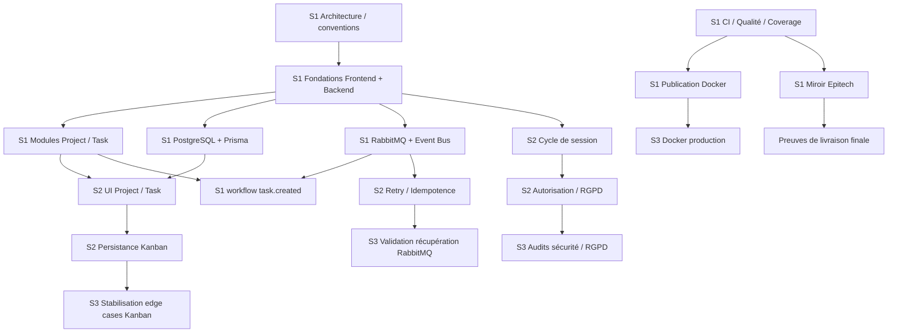

# kanban-app — Backlog & Roadmap

**Version :** 1.1.0  
**Date :** 2026-09-01  
**Source opérationnelle :** GitHub Project  
**Modèle de planification :** 3 sprints d’une semaine, priorisation MoSCoW, estimations en story points

Ce document remplace l’ancien backlog synthétique par la liste de tâches actuellement définie par l’équipe.

Tous les IDs, types, areas, priorités, estimations, valeurs MoSCoW et owners fournis sont conservés.

La seule tâche ajoutée au backlog est :

- `S1-35 — Configure Epitech repository mirror`, car le modèle de livraison défini pour le projet impose la synchronisation automatique des changements validés de `main` vers le dépôt endpoint Epitech.

---

## 1. Revue d’alignement du backlog

### 1.1 Workflow event-driven `S1-27`

Le backlog fourni définit :

```text
S1-27 — Implement first task.created workflow
```

Cette tâche est techniquement cohérente et permet d’établir tôt un premier workflow RabbitMQ.

Cependant, le cahier des charges projet rédigé précédemment avait retenu `TaskAssigned → RabbitMQ → Notification` comme workflow event-driven principal de démonstration.

Le backlog est volontairement conservé tel quel ici. Avant d’implémenter le workflow final de notification, la documentation devra être réconciliée selon l’une de ces approches :

1. conserver `task.created` comme premier vertical slice technique/event du Sprint 1 puis implémenter plus tard un event orienté notification ;
2. remplacer dans l’architecture/spécification l’event officiel de démonstration par `task.created`.

Aucune modification silencieuse n’est faite dans ce backlog.

### 1.2 Miroir du dépôt Epitech

Le miroir du dépôt était absent de la liste fournie alors qu’il fait partie de l’architecture de delivery déjà validée.

Il est donc ajouté sous :

```text
S1-35 — Configure Epitech repository mirror
```

Flow attendu :

```text
PR approuvée
    ↓
Merge vers main protégée
    ↓
CI + contrôles qualité
    ↓
Publication Docker si applicable
    ↓
Miroir de main validée + tags
    ↓
Dépôt endpoint Epitech
```

Le miroir ne doit jamais contourner la validation CI obligatoire.

### 1.3 Positionnement de la quality gate bloquante

`S2-33 — Configure blocking quality gate` est cohérent avec le niveau **Should Have** du MoSCoW.

Cependant, le sujet évalue également la code-quality gate lors de l’Intermediate Review et demande que les fondations CI/qualité soient mises en place tôt. Si l’Intermediate Review intervient immédiatement après le Sprint 1, cette tâche devra être avancée opérationnellement ou `S1-31` devra déjà bloquer sur les contrôles lint/type/tests/coverage/analyse statique nécessaires.

### 1.4 Note de capacité

Les estimations servent à la planification ; elles ne constituent pas une promesse de livraison.

| Sprint | Items | Story points |
|---|---:|---:|
| Sprint 1 | 35 | 109 |
| Sprint 2 | 35 | 116 |
| Sprint 3 | 25 | 83 |
| **Total** | **95** | **308** |

Le backlog est ambitieux pour trois semaines. Le Sprint Planning doit protéger le scope Must et empêcher le démarrage des Should/Could tant que les Must sont instables.

---

## 2. Sprint 1 — Foundation & Architecture

**Objectif principal :** comprendre le legacy, établir l’architecture cible et les fondations de développement, puis démontrer rapidement un premier flow technique end-to-end.

| ID | Issue | Type | Area | Priority | Estimate | MoSCoW | Owner |
|---|---|---|---|---|---:|---|---|
| S1-01 | Analyser la codebase legacy | Task | Architecture | High | 3 | Must | P4 |
| S1-02 | Documenter la dette technique | Task | Architecture | High | 3 | Must | P4 |
| S1-03 | Définir l’architecture cible | Task | Architecture | High | 5 | Must | P4 |
| S1-04 | Définir les conventions de développement | Task | Architecture | High | 2 | Must | P6 |
| S1-05 | Créer le Product Backlog initial | Task | Architecture | High | 3 | Must | PO |
| S1-06 | Initialiser le frontend React + TypeScript | Task | Frontend Core | High | 3 | Must | P1 |
| S1-07 | Créer l’architecture frontend | Task | Frontend Core | High | 2 | Must | P1 |
| S1-08 | Implémenter le routing et le layout applicatif | Feature | Frontend Core | High | 3 | Must | P1 |
| S1-09 | Implémenter le client API | Task | Frontend Core | High | 3 | Must | P1 |
| S1-10 | Créer le squelette UI Project | Feature | Frontend Kanban | High | 3 | Must | P2 |
| S1-11 | Créer le squelette du board Kanban | Feature | Frontend Kanban | High | 3 | Must | P2 |
| S1-12 | Créer le composant Task Card | Feature | Frontend Kanban | Medium | 2 | Must | P2 |
| S1-13 | Prototyper le drag-and-drop | Task | Frontend Kanban | Medium | 3 | Must | P2 |
| S1-14 | Initialiser l’architecture backend TypeScript | Task | Auth & Users | High | 3 | Must | P3 |
| S1-15 | Implémenter le module User | Task | Auth & Users | High | 3 | Must | P3 |
| S1-16 | Implémenter l’inscription | Feature | Auth & Users | High | 3 | Must | P3 |
| S1-17 | Implémenter la connexion | Feature | Auth & Users | High | 3 | Must | P3 |
| S1-18 | Implémenter le middleware d’authentification | Feature | Auth & Users | High | 3 | Must | P3 |
| S1-19 | Implémenter le module Project | Task | Projects & Tasks | High | 3 | Must | P4 |
| S1-20 | Implémenter le CRUD Project | Feature | Projects & Tasks | High | 5 | Must | P4 |
| S1-21 | Implémenter le module Task | Task | Projects & Tasks | High | 3 | Must | P4 |
| S1-22 | Implémenter le CRUD Task | Feature | Projects & Tasks | High | 5 | Must | P4 |
| S1-23 | Configurer PostgreSQL | Task | Data & Events | High | 3 | Must | P5 |
| S1-24 | Configurer l’ORM et les migrations | Task | Data & Events | High | 3 | Must | P5 |
| S1-25 | Configurer RabbitMQ | Task | Data & Events | High | 3 | Must | P5 |
| S1-26 | Implémenter l’abstraction Event Bus | Task | Data & Events | High | 3 | Must | P5 |
| S1-27 | Implémenter le premier workflow task.created | Feature | Data & Events | High | 5 | Must | P5 |
| S1-28 | Dockeriser le frontend | Task | DevOps & QA | High | 2 | Must | P6 |
| S1-29 | Dockeriser le backend | Task | DevOps & QA | High | 2 | Must | P6 |
| S1-30 | Créer l’environnement Docker Compose | Task | DevOps & QA | High | 3 | Must | P6 |
| S1-31 | Configurer la CI GitHub Actions | Task | DevOps & QA | High | 5 | Must | P6 |
| S1-32 | Configurer le lint et le formatting | Task | DevOps & QA | High | 2 | Must | P6 |
| S1-33 | Configurer les tests et la couverture | Task | DevOps & QA | High | 3 | Must | P6 |
| S1-34 | Configurer la publication des images Docker | Task | DevOps & QA | High | 3 | Must | P6 |
| S1-35 | Configurer le miroir du dépôt Epitech | Task | DevOps & QA | High | 3 | Must | P6 |

### Critères de sortie du Sprint 1

Le Sprint 1 doit se terminer avec :

- analyse de la codebase legacy terminée ;
- dette technique documentée ;
- architecture cible documentée et visible dans le code ;
- conventions de développement établies ;
- Product Backlog opérationnel ;
- fondations frontend et backend exécutables ;
- PostgreSQL + migrations Prisma opérationnels ;
- RabbitMQ et abstraction Event Bus opérationnels ;
- au moins un workflow event démontrable ;
- frontend/backend Dockerisés et environnement Docker Compose ;
- CI exécutant lint, formatting, tests et coverage ;
- publication d’image Docker opérationnelle ;
- miroir du dépôt Epitech opérationnel après validation de `main`.

---

## 3. Sprint 2 — Core Features

**Objectif principal :** connecter frontend et backend, compléter le cycle sécurisé de l’application, rendre le Kanban réellement utilisable et renforcer la fiabilité events/tests.

| ID | Issue | Type | Area | Priority | Estimate | MoSCoW | Owner |
|---|---|---|---|---|---:|---|---|
| S2-01 | Connecter l’UI d’inscription à l’API | Feature | Frontend Core | High | 3 | Must | P1 |
| S2-02 | Connecter l’UI de connexion à l’API | Feature | Frontend Core | High | 3 | Must | P1 |
| S2-03 | Implémenter la session authentifiée | Feature | Frontend Core | High | 3 | Must | P1 |
| S2-04 | Implémenter la déconnexion | Feature | Frontend Core | High | 2 | Must | P1 |
| S2-05 | Implémenter le CRUD Project côté frontend | Feature | Frontend Core | High | 5 | Must | P1 |
| S2-06 | Implémenter l’UI du profil utilisateur | Feature | Frontend Core | Medium | 3 | Must | P1 |
| S2-07 | Connecter le board Kanban à l’API | Feature | Frontend Kanban | High | 5 | Must | P2 |
| S2-08 | Implémenter l’UI de création de Task | Feature | Frontend Kanban | High | 3 | Must | P2 |
| S2-09 | Implémenter l’UI d’édition de Task | Feature | Frontend Kanban | High | 3 | Must | P2 |
| S2-10 | Implémenter l’UI de suppression de Task | Feature | Frontend Kanban | High | 2 | Must | P2 |
| S2-11 | Persister le drag-and-drop Kanban | Feature | Frontend Kanban | High | 5 | Must | P2 |
| S2-12 | Ajouter les états loading, error et empty | Task | Frontend Kanban | Medium | 3 | Must | P2 |
| S2-13 | Implémenter le cycle de vie complet de session | Feature | Auth & Users | High | 5 | Must | P3 |
| S2-14 | Implémenter les règles d’autorisation | Feature | Auth & Users | High | 5 | Must | P3 |
| S2-15 | Implémenter GET/PATCH de l’utilisateur courant | Feature | Auth & Users | Medium | 3 | Must | P3 |
| S2-16 | Implémenter la suppression de compte RGPD | Feature | Auth & Users | High | 3 | Must | P3 |
| S2-17 | Implémenter l’export de données RGPD | Feature | Auth & Users | Medium | 3 | Must | P3 |
| S2-18 | Ajouter les tests de sécurité d’authentification | Task | Auth & Users | High | 3 | Must | P3 |
| S2-19 | Implémenter l’ownership des Projects | Feature | Projects & Tasks | High | 3 | Must | P4 |
| S2-20 | Implémenter les règles de statuts Kanban | Feature | Projects & Tasks | High | 3 | Must | P4 |
| S2-21 | Implémenter les priorités de tâches | Feature | Projects & Tasks | Medium | 2 | Should | P4 |
| S2-22 | Implémenter les échéances des tâches | Feature | Projects & Tasks | Medium | 3 | Should | P4 |
| S2-23 | Implémenter la validation métier | Task | Projects & Tasks | High | 3 | Must | P4 |
| S2-24 | Publier l’événement task.updated | Feature | Data & Events | Medium | 2 | Should | P5 |
| S2-25 | Publier l’événement task.completed | Feature | Data & Events | Medium | 2 | Should | P5 |
| S2-26 | Implémenter la persistance des notifications | Feature | Data & Events | Medium | 3 | Should | P5 |
| S2-27 | Implémenter l’API Notifications | Feature | Data & Events | Medium | 3 | Should | P5 |
| S2-28 | Implémenter retry et logging des événements | Task | Data & Events | High | 3 | Must | P5 |
| S2-29 | Implémenter l’idempotence des événements | Task | Data & Events | High | 3 | Must | P5 |
| S2-30 | Implémenter les tests d’intégration API | Task | DevOps & QA | High | 5 | Must | P6 |
| S2-31 | Implémenter les tests d’intégration des événements | Task | DevOps & QA | High | 3 | Must | P6 |
| S2-32 | Implémenter le workflow E2E critique | Task | DevOps & QA | High | 5 | Must | P6 |
| S2-33 | Configurer la quality gate bloquante | Task | DevOps & QA | Medium | 3 | Should | P6 |
| S2-34 | Ajouter la documentation OpenAPI | Task | DevOps & QA | Medium | 3 | Should | P6 |
| S2-35 | Implémenter l’écran d’accueil personnalisé | Feature | Frontend Core | Low | 5 | Should | P1 |

### Critères de sortie du Sprint 2

Le Sprint 2 doit se terminer avec :

- inscription/connexion/session/déconnexion utilisables end-to-end ;
- CRUD Project côté frontend utilisable ;
- board Kanban connecté à l’API ;
- création/édition/suppression Task et drag-and-drop persistants ;
- autorisations et ownership Project appliqués côté serveur ;
- suppression/export RGPD démontrables ;
- validation métier active ;
- priorités/échéances livrées si le scope Must est stable ;
- retry/logging/idempotence events implémentés ;
- tests d’intégration API/events opérationnels ;
- un workflow E2E critique implémenté ;
- quality gate bloquante opérationnelle ;
- OpenAPI et home personnalisé livrés si la capacité Should le permet.

---

## 4. Sprint 3 — Stabilisation & Qualité

**Objectif principal :** stabiliser le produit, fermer la dette technique importante, vérifier sécurité/RGPD/fiabilité events, finaliser les artefacts de livraison et préparer la review finale.

| ID | Issue | Type | Area | Priority | Estimate | MoSCoW | Owner |
|---|---|---|---|---|---:|---|---|
| S3-01 | Corriger les régressions frontend | Bug | Frontend Core | High | 5 | Must | P1 |
| S3-02 | Améliorer le layout responsive | Task | Frontend Core | Medium | 3 | Should | P1 |
| S3-03 | Implémenter la gestion globale des erreurs | Task | Frontend Core | High | 3 | Must | P1 |
| S3-04 | Ajouter les pages 403 et 404 | Feature | Frontend Core | Low | 2 | Should | P1 |
| S3-05 | Corriger les edge cases du drag-and-drop Kanban | Bug | Frontend Kanban | High | 5 | Must | P2 |
| S3-06 | Améliorer le feedback UX du Kanban | Task | Frontend Kanban | Medium | 3 | Should | P2 |
| S3-07 | Réaliser un audit de sécurité de l’authentification | Task | Auth & Users | High | 3 | Must | P3 |
| S3-08 | Réaliser un audit des autorisations | Task | Auth & Users | High | 3 | Must | P3 |
| S3-09 | Réaliser une revue de conformité RGPD | Task | Auth & Users | High | 3 | Must | P3 |
| S3-10 | Résoudre la dette technique backend | Task | Projects & Tasks | High | 5 | Must | P4 |
| S3-11 | Tester les edge cases Project et Task | Task | Projects & Tasks | High | 3 | Must | P4 |
| S3-12 | Implémenter la fermeture automatique des Projects | Feature | Projects & Tasks | Low | 3 | Could | P4 |
| S3-13 | Tester la récupération RabbitMQ | Task | Data & Events | High | 3 | Must | P5 |
| S3-14 | Valider le comportement retry/idempotence | Task | Data & Events | High | 3 | Must | P5 |
| S3-15 | Documenter le workflow event-driven | Task | Data & Events | Medium | 2 | Must | P5 |
| S3-16 | Exécuter la suite complète de régression | Task | DevOps & QA | High | 5 | Must | P6 |
| S3-17 | Atteindre l’objectif final de couverture | Task | DevOps & QA | High | 3 | Must | P6 |
| S3-18 | Configurer l’environnement Docker de production | Task | DevOps & QA | High | 3 | Must | P6 |
| S3-19 | Configurer les healthchecks applicatifs | Task | DevOps & QA | Medium | 2 | Must | P6 |
| S3-20 | Valider la gestion des environnements/secrets | Task | DevOps & QA | High | 2 | Must | P6 |
| S3-21 | Finaliser le README | Task | DevOps & QA | High | 3 | Must | P6 |
| S3-22 | Finaliser la documentation d’architecture | Task | Architecture | High | 3 | Must | P6/P4 |
| S3-23 | Préparer la démonstration finale | Task | Architecture | High | 3 | Must | Team |
| S3-24 | Implémenter le Continuous Delivery complet | Task | DevOps & QA | Low | 5 | Could | P6 |
| S3-25 | Implémenter le contract testing | Task | DevOps & QA | Low | 5 | Could | P6 |

### Critères de sortie du Sprint 3

Le Sprint 3 doit se terminer avec :

- régressions frontend et edge cases Kanban critiques corrigés ;
- gestion globale des erreurs opérationnelle ;
- audits authentication/authorization terminés ;
- conformité RGPD revue ;
- dette technique backend pertinente résolue ou explicitement reportée ;
- edge cases Project/Task testés ;
- récupération RabbitMQ et comportement retry/idempotence validés ;
- suite complète de régression verte ;
- objectif final de coverage atteint ;
- configuration Docker production et healthchecks prêts ;
- gestion environnements/secrets validée ;
- README et documentation d’architecture alignés avec l’implémentation réelle ;
- démonstration finale préparée ;
- Could implémentés uniquement si le scope Must/Should est stable.

---

## 5. Mapping MoSCoW

### Must Have

Le backlog couvre les résultats obligatoires via :

- authentification sécurisée ;
- gestion utilisateur compatible RGPD ;
- CRUD Project ;
- CRUD Task ;
- workflow Kanban basique ;
- pipeline CI ;
- tests et coverage ;
- publication d’image Docker ;
- au moins un workflow event-driven démontrable ;
- architecture et traitement de la dette technique documentés ;
- miroir vers le dépôt Epitech comme contrainte de delivery de l’équipe.

### Should Have

Représentés par :

- priorités de tâches ;
- échéances ;
- persistance/API notifications ;
- home personnalisé ;
- quality gate bloquante ;
- améliorations UX sélectionnées.

### Could Have

Représentés directement par :

- `S3-12` fermeture automatique des Projects ;
- `S3-24` Continuous Delivery complet ;
- `S3-25` contract testing.

---

## 6. Queue d’améliorations produit après MVP

Une fois le scope Must stable, l’équipe priorise les améliorations Kanban dans cet ordre.

### Priorité A

1. **Colonnes Kanban personnalisables**
2. **Labels / tags**
3. **Historique des tâches**
4. **Board collaboratif temps réel**

### Priorité B

5. Recherche et filtres
6. Commentaires
7. Pièces jointes
8. Rappels avancés d’échéance
9. UX de notifications supplémentaire

### Priorité C / futur

10. Notifications email
11. Rôles et permissions avancés
12. Templates de projet
13. Tâches récurrentes
14. Vue calendrier
15. Analytics
16. Intégrations externes

---

## 7. Direction technique future

### Colonnes Kanban personnalisables

Ne pas remplacer les statuts fixes par des strings arbitraires.

Modèle futur recommandé :

```text
Project
  └── KanbanColumn
      ├── id
      ├── name
      ├── position
      └── projectId

Task
  └── columnId
```

Les colonnes initiales restent :

```text
TODO
IN_PROGRESS
DONE
```

et ne sont migrées vers des colonnes gérées par projet que lorsque la feature Could est réellement implémentée.

### Labels / tags

Modèle recommandé :

```text
Label
TaskLabel
```

Les labels restent possédés par le Project.

### Historique des tâches

Stocker des entrées d’historique métier immuables pour les changements significatifs.

Ne pas exposer les logs techniques bruts comme historique utilisateur.

### Board collaboratif temps réel

Le temps réel reste hors MVP.

Évolution future recommandée :

```text
Domain / RabbitMQ events
        ↓
Real-time gateway
        ↓
WebSocket ou SSE
        ↓
Clients React connectés
```

Redis n’est introduit que si un besoin mesuré de scaling/fan-out le justifie.

### Notifications email

Le MVP reste uniquement in-app.

L’envoi email pourra plus tard consommer les mêmes contrats domain/events via un adapter ou worker de notification dédié.

---

## 8. Dépendances principales



Règles supplémentaires :

- le CRUD frontend dépend des endpoints backend correspondants ;
- le drag-and-drop persistant dépend des règles d’update/statut Task ;
- la suppression RGPD dépend du comportement d’ownership et d’autorisation ;
- la persistence/API notifications dépend du workflow de notification retenu ;
- le contract testing n’a de valeur qu’une fois les contrats API/events suffisamment stables ;
- le Continuous Delivery dépend d’un Docker/configuration/healthchecks stables ;
- les features Could ne doivent pas déstabiliser le scope Must.

---

## 9. Règles de maintenance du backlog

Le GitHub Project reste la source de vérité opérationnelle.

Lors d’une modification :

- conserver l’ID si le scope reste identique ;
- splitter une tâche lorsque des critères d’acceptation deviennent indépendamment livrables ;
- éviter de faire grossir silencieusement une tâche `3` ou `5` ;
- mettre à jour les dépendances lorsque le scope change ;
- garder MoSCoW aligné avec le cahier des charges ;
- maintenir les owners à jour ;
- relier la dette technique à `05-TECHNICAL-DEBT.md` ;
- relier les issues livrées aux Pull Requests ;
- mettre à jour cette baseline Markdown lorsque la structure des sprints ou le scope majeur change.

Une feature n’est pas considérée terminée uniquement parce qu’elle fonctionne localement. La Definition of Done, la CI, la couverture, la review et la documentation restent obligatoires.
