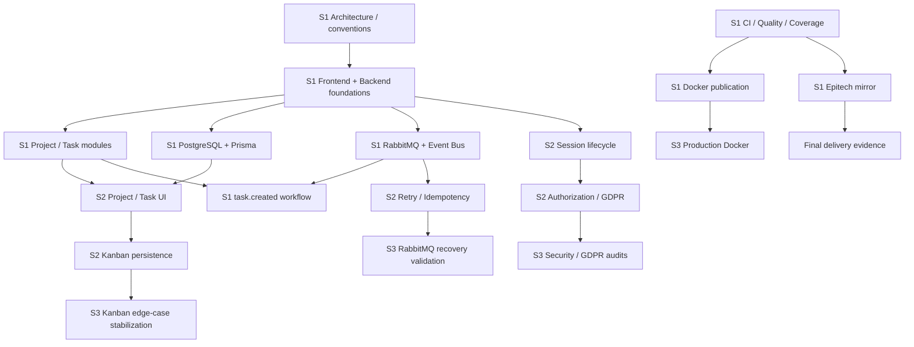

# kanban-app — Backlog & Roadmap

**Version:** 1.1.0  
**Date:** 2026-09-01  
**Operational source of truth:** GitHub Project  
**Planning model:** 3 one-week sprints, MoSCoW prioritization, story-point estimates

This document replaces the previous synthetic backlog with the task list currently defined by the team.

All user-provided IDs, titles, types, areas, priorities, estimates, MoSCoW values and owners are preserved.

The only added backlog item is:

- `S1-35 — Configure Epitech repository mirror`, because the project delivery model requires validated `main` changes to be synchronized automatically to the Epitech endpoint.

---

## 1. Backlog alignment review

### 1.1 `S1-27` event workflow

The supplied backlog defines:

```text
S1-27 — Implement first task.created workflow
```

This is technically valid and satisfies the need to establish a first RabbitMQ workflow early.

However, the current project specification previously selected `TaskAssigned → RabbitMQ → Notification` as the main demonstrable event-driven workflow.

The backlog is intentionally kept unchanged here. Before implementing the final notification workflow, the documentation must be reconciled using one of these approaches:

1. keep `task.created` as the first Sprint 1 technical/event vertical slice, then implement a notification-oriented event later; or
2. replace the official demonstration event in the architecture/specification with `task.created`.

No silent change is made in this backlog.

### 1.2 Repository mirror

The repository mirror was absent from the supplied task list even though it is part of the agreed delivery architecture.

It is therefore added as:

```text
S1-35 — Configure Epitech repository mirror
```

Expected flow:

```text
PR approved
    ↓
Merge to protected main
    ↓
CI + quality checks
    ↓
Docker publication when applicable
    ↓
Mirror validated main + tags
    ↓
Epitech endpoint repository
```

The mirror must never bypass the required CI validation.

### 1.3 Blocking quality gate timing

`S2-33 — Configure blocking quality gate` is coherent with the MoSCoW **Should Have** scope.

However, the assignment also evaluates the code-quality gate during the Intermediate Review and expects CI/quality foundations to exist early. If the Intermediate Review occurs immediately after Sprint 1, this task should be pulled forward operationally or `S1-31` must already enforce the required lint/type/test/coverage/static-analysis checks.

### 1.4 Capacity note

The estimates are planning indicators, not delivery promises.

| Sprint | Items | Story points |
|---|---:|---:|
| Sprint 1 | 35 | 109 |
| Sprint 2 | 35 | 116 |
| Sprint 3 | 25 | 83 |
| **Total** | **95** | **308** |

The backlog is ambitious for three weeks. Sprint Planning should protect Must scope and avoid starting Should/Could work while Must items remain unstable.

---

## 2. Sprint 1 — Foundation & Architecture

**Primary objective:** understand the legacy system, establish the target architecture and development foundations, and demonstrate an early end-to-end technical flow.

| ID | Issue | Type | Area | Priority | Estimate | MoSCoW | Owner |
|---|---|---|---|---|---:|---|---|
| S1-01 | Analyse legacy codebase | Task | Architecture | High | 3 | Must | P4 |
| S1-02 | Document technical debt | Task | Architecture | High | 3 | Must | P4 |
| S1-03 | Define target architecture | Task | Architecture | High | 5 | Must | P4 |
| S1-04 | Define development conventions | Task | Architecture | High | 2 | Must | P6 |
| S1-05 | Create initial Product Backlog | Task | Architecture | High | 3 | Must | PO |
| S1-06 | Initialize React + TypeScript frontend | Task | Frontend Core | High | 3 | Must | P1 |
| S1-07 | Create frontend architecture | Task | Frontend Core | High | 2 | Must | P1 |
| S1-08 | Implement routing and application layout | Feature | Frontend Core | High | 3 | Must | P1 |
| S1-09 | Implement API client | Task | Frontend Core | High | 3 | Must | P1 |
| S1-10 | Create Project UI skeleton | Feature | Frontend Kanban | High | 3 | Must | P2 |
| S1-11 | Create Kanban board skeleton | Feature | Frontend Kanban | High | 3 | Must | P2 |
| S1-12 | Create Task Card component | Feature | Frontend Kanban | Medium | 2 | Must | P2 |
| S1-13 | Prototype drag and drop | Task | Frontend Kanban | Medium | 3 | Must | P2 |
| S1-14 | Initialize TypeScript backend architecture | Task | Auth & Users | High | 3 | Must | P3 |
| S1-15 | Implement User module | Task | Auth & Users | High | 3 | Must | P3 |
| S1-16 | Implement registration | Feature | Auth & Users | High | 3 | Must | P3 |
| S1-17 | Implement login | Feature | Auth & Users | High | 3 | Must | P3 |
| S1-18 | Implement authentication middleware | Feature | Auth & Users | High | 3 | Must | P3 |
| S1-19 | Implement Project module | Task | Projects & Tasks | High | 3 | Must | P4 |
| S1-20 | Implement Project CRUD | Feature | Projects & Tasks | High | 5 | Must | P4 |
| S1-21 | Implement Task module | Task | Projects & Tasks | High | 3 | Must | P4 |
| S1-22 | Implement Task CRUD | Feature | Projects & Tasks | High | 5 | Must | P4 |
| S1-23 | Configure PostgreSQL | Task | Data & Events | High | 3 | Must | P5 |
| S1-24 | Configure ORM and migrations | Task | Data & Events | High | 3 | Must | P5 |
| S1-25 | Configure RabbitMQ | Task | Data & Events | High | 3 | Must | P5 |
| S1-26 | Implement Event Bus abstraction | Task | Data & Events | High | 3 | Must | P5 |
| S1-27 | Implement first task.created workflow | Feature | Data & Events | High | 5 | Must | P5 |
| S1-28 | Dockerize frontend | Task | DevOps & QA | High | 2 | Must | P6 |
| S1-29 | Dockerize backend | Task | DevOps & QA | High | 2 | Must | P6 |
| S1-30 | Create Docker Compose environment | Task | DevOps & QA | High | 3 | Must | P6 |
| S1-31 | Configure GitHub Actions CI | Task | DevOps & QA | High | 5 | Must | P6 |
| S1-32 | Configure lint and formatting | Task | DevOps & QA | High | 2 | Must | P6 |
| S1-33 | Configure tests and coverage | Task | DevOps & QA | High | 3 | Must | P6 |
| S1-34 | Configure Docker image publication | Task | DevOps & QA | High | 3 | Must | P6 |
| S1-35 | Configure Epitech repository mirror | Task | DevOps & QA | High | 3 | Must | P6 |

### Sprint 1 exit criteria

Sprint 1 should end with:

- legacy codebase analysis completed;
- technical debt documented;
- target architecture documented and visible in code;
- development conventions established;
- Product Backlog operational;
- frontend and backend foundations running;
- PostgreSQL + Prisma migrations operational;
- RabbitMQ and Event Bus foundation operational;
- at least one demonstrable event workflow;
- Dockerized frontend/backend and Docker Compose environment;
- CI running lint, formatting, tests and coverage;
- Docker image publication operational;
- Epitech repository mirror operational after validated `main`.

---

## 3. Sprint 2 — Core Features

**Primary objective:** connect the frontend and backend, complete the secure application lifecycle, make the Kanban workflow usable, and strengthen event reliability and testing.

| ID | Issue | Type | Area | Priority | Estimate | MoSCoW | Owner |
|---|---|---|---|---|---:|---|---|
| S2-01 | Connect registration UI to API | Feature | Frontend Core | High | 3 | Must | P1 |
| S2-02 | Connect login UI to API | Feature | Frontend Core | High | 3 | Must | P1 |
| S2-03 | Implement authenticated session | Feature | Frontend Core | High | 3 | Must | P1 |
| S2-04 | Implement logout | Feature | Frontend Core | High | 2 | Must | P1 |
| S2-05 | Implement Project frontend CRUD | Feature | Frontend Core | High | 5 | Must | P1 |
| S2-06 | Implement user profile UI | Feature | Frontend Core | Medium | 3 | Must | P1 |
| S2-07 | Connect Kanban board to API | Feature | Frontend Kanban | High | 5 | Must | P2 |
| S2-08 | Implement Task creation UI | Feature | Frontend Kanban | High | 3 | Must | P2 |
| S2-09 | Implement Task edition UI | Feature | Frontend Kanban | High | 3 | Must | P2 |
| S2-10 | Implement Task deletion UI | Feature | Frontend Kanban | High | 2 | Must | P2 |
| S2-11 | Persist Kanban drag and drop | Feature | Frontend Kanban | High | 5 | Must | P2 |
| S2-12 | Add loading, error and empty states | Task | Frontend Kanban | Medium | 3 | Must | P2 |
| S2-13 | Implement complete session lifecycle | Feature | Auth & Users | High | 5 | Must | P3 |
| S2-14 | Implement authorization rules | Feature | Auth & Users | High | 5 | Must | P3 |
| S2-15 | Implement GET/PATCH current user | Feature | Auth & Users | Medium | 3 | Must | P3 |
| S2-16 | Implement GDPR account deletion | Feature | Auth & Users | High | 3 | Must | P3 |
| S2-17 | Implement GDPR data export | Feature | Auth & Users | Medium | 3 | Must | P3 |
| S2-18 | Add authentication security tests | Task | Auth & Users | High | 3 | Must | P3 |
| S2-19 | Implement Project ownership | Feature | Projects & Tasks | High | 3 | Must | P4 |
| S2-20 | Implement Kanban status rules | Feature | Projects & Tasks | High | 3 | Must | P4 |
| S2-21 | Implement task priorities | Feature | Projects & Tasks | Medium | 2 | Should | P4 |
| S2-22 | Implement task deadlines | Feature | Projects & Tasks | Medium | 3 | Should | P4 |
| S2-23 | Implement domain validation | Task | Projects & Tasks | High | 3 | Must | P4 |
| S2-24 | Publish task.updated event | Feature | Data & Events | Medium | 2 | Should | P5 |
| S2-25 | Publish task.completed event | Feature | Data & Events | Medium | 2 | Should | P5 |
| S2-26 | Implement Notification persistence | Feature | Data & Events | Medium | 3 | Should | P5 |
| S2-27 | Implement Notifications API | Feature | Data & Events | Medium | 3 | Should | P5 |
| S2-28 | Implement event retry and logging | Task | Data & Events | High | 3 | Must | P5 |
| S2-29 | Implement event idempotency | Task | Data & Events | High | 3 | Must | P5 |
| S2-30 | Implement API integration tests | Task | DevOps & QA | High | 5 | Must | P6 |
| S2-31 | Implement event integration tests | Task | DevOps & QA | High | 3 | Must | P6 |
| S2-32 | Implement critical E2E workflow | Task | DevOps & QA | High | 5 | Must | P6 |
| S2-33 | Configure blocking quality gate | Task | DevOps & QA | Medium | 3 | Should | P6 |
| S2-34 | Add OpenAPI documentation | Task | DevOps & QA | Medium | 3 | Should | P6 |
| S2-35 | Implement personalised home screen | Feature | Frontend Core | Low | 5 | Should | P1 |

### Sprint 2 exit criteria

Sprint 2 should end with:

- registration/login/session/logout usable end-to-end;
- Project frontend CRUD usable;
- Kanban connected to the API;
- Task create/edit/delete and drag-and-drop persistent;
- authorization and Project ownership enforced server-side;
- GDPR deletion/export demonstrable;
- domain validation active;
- priorities/deadlines delivered if Must scope remains stable;
- event retry/logging/idempotency implemented;
- API/event integration tests operational;
- one critical E2E workflow implemented;
- blocking quality gate operational;
- OpenAPI and personalized home delivered if Should scope capacity allows.

---

## 4. Sprint 3 — Stabilization & Quality

**Primary objective:** stabilize the product, close important technical debt, verify security/GDPR/event reliability, finalize delivery artifacts and prepare the final review.

| ID | Issue | Type | Area | Priority | Estimate | MoSCoW | Owner |
|---|---|---|---|---|---:|---|---|
| S3-01 | Fix frontend regression issues | Bug | Frontend Core | High | 5 | Must | P1 |
| S3-02 | Improve responsive layout | Task | Frontend Core | Medium | 3 | Should | P1 |
| S3-03 | Implement global error handling | Task | Frontend Core | High | 3 | Must | P1 |
| S3-04 | Add 403 and 404 pages | Feature | Frontend Core | Low | 2 | Should | P1 |
| S3-05 | Fix Kanban drag-and-drop edge cases | Bug | Frontend Kanban | High | 5 | Must | P2 |
| S3-06 | Improve Kanban UX feedback | Task | Frontend Kanban | Medium | 3 | Should | P2 |
| S3-07 | Perform authentication security audit | Task | Auth & Users | High | 3 | Must | P3 |
| S3-08 | Perform authorization audit | Task | Auth & Users | High | 3 | Must | P3 |
| S3-09 | Perform GDPR compliance review | Task | Auth & Users | High | 3 | Must | P3 |
| S3-10 | Resolve backend technical debt | Task | Projects & Tasks | High | 5 | Must | P4 |
| S3-11 | Test Project and Task edge cases | Task | Projects & Tasks | High | 3 | Must | P4 |
| S3-12 | Implement automatic project closure | Feature | Projects & Tasks | Low | 3 | Could | P4 |
| S3-13 | Test RabbitMQ recovery | Task | Data & Events | High | 3 | Must | P5 |
| S3-14 | Validate retry/idempotency behaviour | Task | Data & Events | High | 3 | Must | P5 |
| S3-15 | Document event-driven workflow | Task | Data & Events | Medium | 2 | Must | P5 |
| S3-16 | Run complete regression suite | Task | DevOps & QA | High | 5 | Must | P6 |
| S3-17 | Reach final coverage target | Task | DevOps & QA | High | 3 | Must | P6 |
| S3-18 | Configure production Docker environment | Task | DevOps & QA | High | 3 | Must | P6 |
| S3-19 | Configure application healthchecks | Task | DevOps & QA | Medium | 2 | Must | P6 |
| S3-20 | Validate environment/secrets handling | Task | DevOps & QA | High | 2 | Must | P6 |
| S3-21 | Finalise README | Task | DevOps & QA | High | 3 | Must | P6 |
| S3-22 | Finalise architecture documentation | Task | Architecture | High | 3 | Must | P6/P4 |
| S3-23 | Prepare final demonstration | Task | Architecture | High | 3 | Must | Team |
| S3-24 | Implement complete Continuous Delivery | Task | DevOps & QA | Low | 5 | Could | P6 |
| S3-25 | Implement contract testing | Task | DevOps & QA | Low | 5 | Could | P6 |

### Sprint 3 exit criteria

Sprint 3 should end with:

- frontend regressions and critical Kanban edge cases fixed;
- global error handling operational;
- authentication/authorization audits completed;
- GDPR compliance reviewed;
- relevant backend technical debt resolved or explicitly deferred;
- Project/Task edge cases tested;
- RabbitMQ recovery and retry/idempotency behavior validated;
- complete regression suite green;
- final coverage target reached;
- production Docker configuration and healthchecks ready;
- environment/secrets handling validated;
- README and architecture documentation aligned with the actual implementation;
- final demonstration prepared;
- Could items implemented only if Must/Should scope is stable.

---

## 5. MoSCoW mapping

### Must Have

The backlog covers the mandatory project outcomes through:

- secure authentication;
- GDPR-compatible user management;
- Project CRUD;
- Task CRUD;
- basic Kanban workflow;
- CI pipeline;
- tests and coverage;
- Docker image publication;
- at least one demonstrable event-driven workflow;
- documented architecture and technical-debt treatment;
- repository mirroring to the Epitech endpoint as a team delivery constraint.

### Should Have

Represented by:

- task priorities;
- task deadlines;
- notification persistence/API;
- personalized home screen;
- blocking quality gate;
- selected UX improvements.

### Could Have

Directly represented by:

- `S3-12` automatic project closure;
- `S3-24` complete Continuous Delivery;
- `S3-25` contract testing.

---

## 6. Product improvement queue after MVP

Once Must scope is stable, the team prioritizes additional Kanban value in this order.

### Priority A

1. **Custom Kanban columns**
2. **Labels / tags**
3. **Task history**
4. **Real-time collaborative board**

### Priority B

5. Search and filters
6. Comments
7. Attachments
8. Advanced deadline reminders
9. Additional notification UX

### Priority C / future

10. Email notifications
11. Advanced roles and permissions
12. Project templates
13. Recurring tasks
14. Calendar view
15. Analytics
16. External integrations

---

## 7. Future technical direction

### Custom Kanban columns

Do not replace the fixed statuses with arbitrary strings.

Preferred future model:

```text
Project
  └── KanbanColumn
      ├── id
      ├── name
      ├── position
      └── projectId

Task
  └── columnId
```

The initial fixed columns remain:

```text
TODO
IN_PROGRESS
DONE
```

and are migrated to project-owned columns only when the Could feature is implemented.

### Labels / tags

Preferred model:

```text
Label
TaskLabel
```

Labels remain project-owned.

### Task history

Store meaningful immutable domain-history entries for task changes.

Do not use raw technical logs as the user-facing history.

### Real-time collaborative board

Real-time collaboration remains outside the MVP.

Preferred future evolution:

```text
Domain / RabbitMQ events
        ↓
Real-time gateway
        ↓
WebSocket or SSE
        ↓
Connected React clients
```

Redis is not introduced unless a measured scaling/fan-out requirement justifies it.

### Email notifications

The MVP remains in-app only.

Email delivery can later consume the same domain/event contracts through a dedicated notification adapter or worker.

---

## 8. Main dependency rules



Additional rules:

- frontend CRUD depends on corresponding backend endpoints;
- persistent drag-and-drop depends on Task status/update rules;
- GDPR deletion depends on ownership and authorization behavior;
- notification persistence/API depends on the selected notification event workflow;
- contract testing is only useful after API/event contracts are stable;
- Continuous Delivery depends on stable Docker, configuration and healthchecks;
- Could product features must not destabilize Must scope.

---

## 9. Backlog maintenance rules

The GitHub Project remains the live operational source of truth.

When modifying the backlog:

- preserve an issue ID when the scope remains the same;
- split an item if independent acceptance criteria justify separate delivery;
- avoid silently growing a `3` or `5` into an oversized item;
- update dependencies when scope changes;
- keep MoSCoW aligned with the project specification;
- keep owner assignment current;
- keep technical debt linked to `05-TECHNICAL-DEBT.md`;
- link delivered issues to Pull Requests;
- update this Markdown baseline when sprint structure or major scope changes.

A feature is not considered complete only because it works locally. The project's Definition of Done, CI, coverage, review and documentation requirements still apply.
