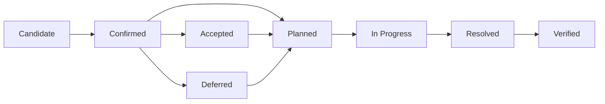
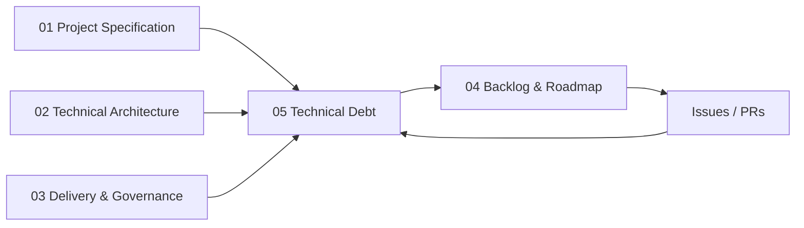

# kanban-app — Registre de dette technique

**Version :** 1.0.0  
**Statut :** Registre vivant  
**Date :** 2026-09-01  
**Langue de référence :** anglais  
**Source opérationnelle :** issues / GitHub Project

---

## 1. Objectif

Ce document enregistre, priorise et suit la dette technique pendant la transformation de la TodoList en application Kanban.

Le sujet part explicitement d'une application existante ayant accumulé de la dette technique et demande à l'équipe d'identifier ses limites, d'améliorer sa maintenabilité et son évolutivité, puis de démontrer l'évolution du code par des preuves d'ingénierie.

Le registre a quatre objectifs :

1. rendre les problèmes legacy explicites au lieu de les cacher dans les features ;
2. distinguer la **dette confirmée** des hypothèses qui nécessitent encore l'audit du dépôt ;
3. relier chaque dette à une tâche de correction, une Pull Request et une preuve de validation ;
4. enregistrer la dette **volontairement acceptée ou reportée** pour protéger le périmètre des trois semaines.

Ce fichier ne remplace pas le backlog. Le backlog suit le travail à réaliser. Ce document explique **pourquoi ce travail existe, quel coût d'ingénierie la dette provoque et quand elle peut être considérée comme résolue**.

---

## 2. Définition de la dette technique

Une dette technique est un compromis, une faiblesse ou une capacité d'ingénierie manquante qui rend le système plus difficile, risqué ou coûteux à modifier, tester, sécuriser, exploiter ou déployer.

Catégories typiques du projet :

- Architecture
- Structure / maintenabilité du code
- Typage
- Tests / couverture
- Sécurité
- Intégrité des données
- Fiabilité event-driven
- Build / dépendances
- CI / qualité
- Docker / delivery
- Documentation
- Observabilité

### Ce qui n'est pas automatiquement de la dette

L'absence des fonctionnalités suivantes du MVP n'est **pas**, à elle seule, de la dette technique :

- colonnes Kanban personnalisables ;
- labels/tags ;
- historique des tâches ;
- collaboration temps réel ;
- notifications email ;
- commentaires ou pièces jointes.

Ce sont des décisions de périmètre produit. Elles deviennent de la dette uniquement si l'implémentation actuelle crée des raccourcis qui rendent inutilement difficile leur ajout futur.

---

## 3. Origine de la dette

| Origine | Définition |
|---|---|
| **Legacy** | Dette héritée de la TodoList fournie |
| **Écart à la cible** | Capacité d'ingénierie requise qui n'existe pas encore pendant la migration |
| **Migration** | Duplication/compatibilité temporaire créée par le refactor incrémental |
| **Intentionnelle** | Compromis accepté consciemment avec raison et condition de révision |
| **Régression** | Nouvelle dette introduite pendant le projet et détectée ensuite |

---

## 4. Cycle de vie



| Statut | Signification |
|---|---|
| **Candidate** | Suspicion ou point d'audit, pas encore prouvé dans le dépôt |
| **Confirmed** | Preuve disponible dans le code, la configuration, les tests, la CI ou le runtime |
| **Planned** | Correction reliée à une issue/tâche et priorisée |
| **In Progress** | Correction en cours |
| **Resolved** | Correction mergée, validation finale éventuellement restante |
| **Verified** | Critères et preuves confirment la suppression/réduction de la dette |
| **Accepted** | Compromis explicitement accepté pour la livraison actuelle |
| **Deferred** | Dette valide volontairement reportée avec raison et condition de reprise |

Un élément Candidate ne doit pas être présenté comme un défaut legacy confirmé tant qu'aucune preuve du dépôt n'existe.

---

## 5. Sévérité

| Sévérité | Signification | Traitement attendu |
|---|---|---|
| **Critical** | Sécurité/perte de données/blocage delivery ou exigence obligatoire impossible à valider | Correction immédiate ; bloque la release |
| **High** | Impact fort sur maintenabilité, testabilité, fiabilité ou exigences obligatoires | Sprint 1–2 ou avant les features dépendantes |
| **Medium** | Coût récurrent réel sans blocage immédiat | À planifier selon dépendances |
| **Low** | Friction locale ou nettoyage limité | Opportuniste ; peut rester accepté |

La priorité tient aussi compte :

- des Must/Should bloqués ;
- du nombre de stories dépendantes ;
- du coût futur si la correction est retardée ;
- de l'impact sécurité/intégrité ;
- de la fréquence de friction pour les développeurs ;
- des preuves et de l'effort de correction.

---

## 6. Preuves attendues

Chaque dette **Confirmed** doit référencer au moins une preuve objective lorsque cela s'applique :

- fichier/module/path ;
- scénario de test manquant ou en échec ;
- diagnostic TypeScript ;
- finding ESLint/Sonar ;
- rapport de couverture ;
- run CI ;
- échec Docker/build ;
- test de sécurité ;
- audit de dépendances ;
- log runtime ;
- violation de frontière/duplication de responsabilité ;
- discussion de Pull Request.

Pour une dette corrigée, lier la PR et le résultat de vérification.

Labels GitHub recommandés :

```text
technical-debt
legacy
architecture
security
quality
testing
devops
events
database
```

---

## 7. Registre initial

Le sujet demande d'inspecter la structure existante, l'organisation frontend/backend, la répartition des responsabilités, la stratégie de tests, le niveau de typage/qualité et le build/déploiement. Plusieurs entrées commencent donc volontairement en **Candidate** plutôt que d'inventer des défauts qui n'ont pas encore été observés.

| ID | Dette / investigation | Origine | Catégorie | Statut | Sévérité | Travail lié | Cible |
|---|---|---|---|---|---|---|---|
| TD-001 | Architecture du dépôt et frontières de responsabilités pas encore formellement cartographiées | Legacy | Architecture | Candidate | High | S1-01, S1-03 | Sprint 1 |
| TD-002 | Le legacy peut mélanger logique métier, HTTP, persistence ou UI | Legacy | Maintenabilité | Candidate | High | S1-01, S1-07, S1-13, S1-14 | Sprint 1–2 |
| TD-003 | Baseline TypeScript strict / typage actuel à auditer et normaliser | Legacy / Écart cible | Typage | Candidate | High | S1-06 | Sprint 1 |
| TD-004 | Stratégie de tests automatisés et couverture utile actuelle non encore établie | Legacy / Écart cible | Tests | Candidate | High | S1-01, S1-33, S2-32, S2-33 | Sprint 1–2 |
| TD-005 | Lint/format/type/qualité existants à auditer ; tout contrôle requis manquant doit être établi | Legacy / Écart cible | Qualité | Candidate | High | S1-32, S1-34, S1-35 | Sprint 1 |
| TD-006 | Capacité CI existante à auditer puis aligner sur la baseline de validation PR/push requise | Legacy / Écart cible | Delivery | Candidate | Critical | Fondation CI / S1-36 | Sprint 1 |
| TD-007 | Conteneurisation/delivery existants à auditer ; publication Docker reproductible via CI requise | Legacy / Écart cible | Delivery | Candidate | Critical | S1-36 | Sprint 1 |
| TD-008 | Reproductibilité du build et de l'environnement local à auditer | Legacy / Écart cible | Build | Candidate | High | S1-01, S1-08, S1-09, S1-10 | Sprint 1 |
| TD-009 | Communication inter-composants existante à auditer ; un workflow event-driven complet doit satisfaire la baseline cible | Legacy / Écart cible | Events | Candidate | Critical | S1-24 à S1-28 | Sprint 1 |
| TD-010 | Ownership des données et accès inter-modules à faire respecter pendant le refactor | Écart cible | Architecture / Data | Planned | High | S1-11, S1-13 | Sprint 1–2 |
| TD-011 | Auth/session et posture sécurité du legacy à auditer explicitement | Legacy | Sécurité | Candidate | Critical | S1-15 à S1-19, S2-01 à S2-04, S3-06 | Sprint 1–3 |
| TD-012 | Autorisations serveur projets/tâches à vérifier et centraliser | Legacy / Écart cible | Sécurité | Candidate | Critical | S2-10, S3-07 | Sprint 2–3 |
| TD-013 | Contraintes, relations et historique des migrations DB à vérifier avant stabilisation | Legacy / Écart cible | Intégrité | Candidate | High | S1-10, S1-11, S3-09 | Sprint 1 + revue Sprint 3 |
| TD-014 | Variables d'environnement et secrets à auditer dans repo + CI | Legacy / Écart cible | Sécurité / DevOps | Candidate | Critical | S1-08, S3-15 | Sprint 1–3 |
| TD-015 | Delivery nécessite un miroir contrôlé repo organisation → repo Epitech | Écart cible | Delivery | Planned | High | S3-16, S3-17 | Fondation tôt ; validation Sprint 3 |
| TD-016 | Risque de divergence documentation/code pendant l'évolution | Migration | Documentation | Accepted | Medium | S3-18, S3-19 + DoD | Continu |
| TD-017 | Commit DB + publication RabbitMQ exposés initialement à une fenêtre de dual-write | Intentionnelle | Fiabilité events | Accepted | High | S3-10, S3-11, S3-12 | Hardening Sprint 3 ; outbox Could |
| TD-018 | Les consumers RabbitMQ peuvent recevoir des doublons ; idempotence à vérifier par handler | Intentionnelle / Écart cible | Fiabilité events | Planned | High | S3-10, S3-11 | Sprint 3 |
| TD-019 | Observabilité volontairement limitée aux logs structurés, correlation IDs et health/readiness | Intentionnelle | Exploitation | Accepted | Medium | S3-14 + baseline architecture | Minimum Sprint 3 ; avancé futur |
| TD-020 | Hébergement free-tier optionnel sans SLA production, pouvant sleep/throttle | Intentionnelle | Infrastructure | Accepted | Low | S3-21 | Démo uniquement |

### Interprétation

`TD-001` à `TD-004`, `TD-008`, `TD-011` à `TD-014` sont des **candidats d'audit** tant que le dépôt réel n'a pas fourni de preuve.

`TD-005` à `TD-010` sont des éléments d'audit/baseline cible : après inspection, ils restent dans la dette uniquement si l'implémentation actuelle crée réellement un écart d'ingénierie ; sinon l'implémentation requise reste uniquement dans le backlog. `TD-015` est un écart delivery confirmé puisque le dépôt de l'organisation doit être synchronisé vers le dépôt Epitech.

`TD-017` à `TD-020` sont des limitations volontairement assumées par l'architecture trois semaines et doivent rester visibles au lieu d'être présentées comme des garanties production.

---

## 8. Stratégie par sprint

### Sprint 1 — Découvrir et réduire la dette structurelle

- confirmer/rejeter les Candidates ;
- capturer les preuves avant les gros refactors ;
- établir les frontières de modules ;
- établir le typage strict ;
- fiabiliser config/DB/build ;
- établir tests/couverture ;
- établir lint/format/analyse statique ;
- établir CI + publication Docker ;
- démontrer un premier flux RabbitMQ complet.

```text
Dette legacy inconnue
        ↓
Registre fondé sur des preuves
        ↓
Corrections priorisées
        ↓
Fondation technique propre
```

### Sprint 2 — Empêcher la nouvelle dette pendant les features

- logique métier hors controllers/components ;
- tests avec chaque use case ;
- autorisations centralisées ;
- accès Prisma dans les frontières prévues ;
- contrats d'events respectés ;
- PR petites et reviewables ;
- ne jamais affaiblir le strict mode ou les quality gates pour merger plus vite.

### Sprint 3 — Stabiliser et fermer la dette à forte valeur

- fermer les gaps de couverture Must ;
- résoudre les findings quality bloquants ;
- revue sécurité/autorisations ;
- revue contraintes/index DB ;
- hardening RabbitMQ retry/idempotence ;
- validation Docker + miroir ;
- réconciliation documentation/code ;
- accepter/report explicitement ce qui reste.

Le sujet attend explicitement que le Sprint 3 traite stabilisation et dette technique : la review finale doit donc montrer l'évolution de ce registre, pas uniquement sa version initiale.

---

## 9. Définition d'une dette résolue

Une dette passe **Verified** seulement si les conditions pertinentes sont remplies :

1. la cause technique racine est corrigée, pas seulement cachée ;
2. le changement est relié à une issue/tâche ;
3. la correction passe par une PR reviewée ;
4. les tests pertinents sont ajoutés/mis à jour ;
5. CI et quality gates passent ;
6. documentation/architecture est mise à jour si le contrat change ;
7. une preuve avant/après existe lorsque cela apporte de la valeur ;
8. aucun workaround équivalent ne reste dans le même périmètre.

### Exemple typage

Insuffisant :

```text
Ajouter `any` ou désactiver une règle.
```

Résolu :

```text
Modéliser correctement → compilation strict OK → tests OK.
```

### Exemple couverture

Insuffisant :

```text
Ajouter des assertions uniquement pour monter le pourcentage.
```

Résolu :

```text
Règles métier critiques réellement testées + seuils respectés.
```

### Exemple architecture

Insuffisant :

```text
Déplacer les fichiers dans des dossiers sans corriger les dépendances.
```

Résolu :

```text
Responsabilités et direction des dépendances respectent les frontières documentées.
```

---

## 10. Politique de dette intentionnelle

Une dette intentionnelle est autorisée uniquement si sont enregistrés :

- le compromis ;
- la raison ;
- la conséquence/risque ;
- le responsable ou domaine ;
- la condition de révision ;
- le sprint/milestone cible.

Elle ne peut pas servir à contourner :

- sécurité/authentification ;
- RGPD ;
- CI obligatoire ;
- publication Docker ;
- workflow event-driven obligatoire ;
- défaut critique bloquant la release.

Exemple :

```text
Transactional outbox non obligatoire pour le premier workflow event.

Raison :
Périmètre 3 semaines + besoin d'un workflow démontrable.

Conséquence :
Petite fenêtre de panne entre commit DB et publish broker.

Mitigation :
Abstraction publisher + erreurs/retry explicites + revue Sprint 3.

Revue :
Ajouter l'outbox si les tests de fiabilité exposent le problème ou si le temps le permet.
```

---

## 11. Prévention de nouvelle dette

Le nouveau code ne doit pas introduire silencieusement :

- `any` pour contourner un problème de modélisation ;
- désactivation globale TypeScript/ESLint/Sonar pour faire passer la CI ;
- logique métier dans composants React ou controllers HTTP ;
- requêtes Prisma inter-modules arbitraires ;
- autorisations dupliquées ;
- secrets commités ;
- events non versionnés ;
- erreurs ignorées dans les consumers ;
- règles métier critiques sans tests ;
- étapes de delivery manuelles contredisant la CI documentée ;
- gros refactors mélangés à une feature sans rapport.

### Boy-scout rule

Un petit nettoyage local directement lié au travail courant est encouragé s'il ne grossit pas fortement la PR.

Une dette importante sans rapport devient une issue séparée.

---

## 12. Check dette dans les PR

Chaque PR devrait indiquer :

```text
Technical debt impact:
[ ] No new known technical debt
[ ] Existing debt reduced: TD-___
[ ] New/intentional debt introduced: TD-___ (documented)
```

Une PR aggravant silencieusement une dette Critical/High connue doit être refusée sans justification.

---

## 13. Template d'issue Technical Debt

```markdown
## Technical debt

Debt ID: TD-XXX
Origin: Legacy | Target gap | Migration | Intentional | Regression
Category: Architecture | Quality | Testing | Security | Data | Events | DevOps | Other
Severity: Critical | High | Medium | Low

## Evidence
- Path / CI run / Sonar finding / test / behavior:

## Impact
Décrire le coût ou risque concret.

## Desired state
Décrire l'état technique attendu après correction.

## Acceptance criteria
- [ ] Root cause addressed
- [ ] Tests added/updated
- [ ] CI green
- [ ] Documentation updated if required
- [ ] Debt register updated

## Related work
Issue/Story:
Dependencies:

## Resolution evidence
PR:
Before/after result:
```

---

## 14. Preuves de review

### Review intermédiaire

Montrer :

1. registre Candidate initial ;
2. preuves du dépôt ayant confirmé/rejeté les éléments ;
3. dettes à plus fort impact choisies Sprint 1 ;
4. exemples architecture avant/après ;
5. évolution TypeScript/lint/tests/couverture/CI ;
6. fondation event-driven ;
7. liens dette → issue → PR.

### Review finale

Montrer :

1. nombre initial/final par statut et sévérité ;
2. dette Critical/High restante et justification ;
3. évolution qualité/couverture ;
4. revues sécurité/data/fiabilité events ;
5. PR de résolution ;
6. dette intentionnelle encore acceptée ;
7. dette future documentée au lieu d'être cachée.

Table récapitulative utile :

| Métrique | Initial | Final |
|---|---:|---:|
| Confirmed Critical | TBD | TBD |
| Confirmed High | TBD | TBD |
| Verified | 0 | TBD |
| Accepted/Deferred | TBD | TBD |
| Couverture globale | TBD | ≥70% cible |
| Couverture métier/domain | TBD | ≥80% cible |
| Quality gate bloquante | TBD | Green cible |

Ne pas inventer les valeurs initiales. Les remplir après l'audit Sprint 1.

---

## 15. Relation avec les autres documents



- `01-PROJECT-SPECIFICATION.md` définit les résultats produit/qualité.
- `02-TECHNICAL-ARCHITECTURE.md` définit l'état technique cible.
- `03-DELIVERY-GOVERNANCE.md` définit les règles qualité/PR/DoD.
- `04-BACKLOG-ROADMAP.md` planifie le travail.
- `05-TECHNICAL-DEBT.md` suit l'écart entre état actuel et état cible, ainsi que les compromis acceptés.
- GitHub issues/PRs contiennent les preuves opérationnelles vivantes.

---

## 16. Règle de maintenance

Mettre à jour le registre :

- pendant/après l'audit legacy Sprint 1 ;
- à chaque nouvelle dette importante découverte ;
- lorsqu'un compromis architectural est accepté ;
- lorsqu'une PR liée est mergée ;
- pendant chaque rétrospective ;
- avant la Review intermédiaire ;
- avant la Review finale.

Le registre doit décrire la réalité. Ne pas conserver artificiellement des dettes résolues et ne pas marquer des Candidates comme confirmées sans preuve.
