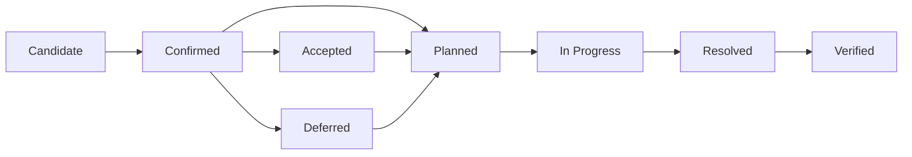
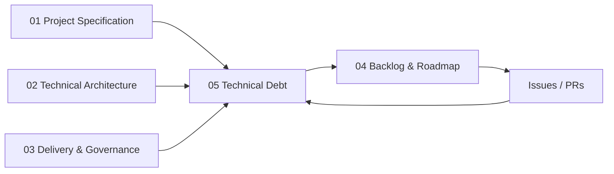

# kanban-app — Technical Debt Register

**Version:** 1.0.0  
**Status:** Living register  
**Date:** 2026-09-01  
**Reference language:** English  
**Operational source of truth:** GitHub issues / GitHub Project

---

## 1. Purpose

This document records, prioritizes and tracks technical debt throughout the TodoList-to-Kanban rework.

The assignment explicitly starts from an existing application that has accumulated technical debt and requires the team to identify its limitations, improve maintainability and scalability, and demonstrate the evolution of the codebase through engineering evidence.

The register has four objectives:

1. make legacy problems explicit instead of hiding them inside feature work;
2. distinguish **confirmed debt** from assumptions that still require repository inspection;
3. connect each debt item to a concrete remediation task, Pull Request and verification evidence;
4. record debt that the team **intentionally accepts or defers** in order to protect the three-week delivery scope.

This file is not a duplicate backlog. The backlog tracks work to perform. This document explains **why the work exists, what engineering cost the debt creates, and when the debt can be considered resolved**.

---

## 2. What counts as technical debt

A Technical Debt item is a technical compromise, weakness or missing engineering capability that makes the system harder, riskier or more expensive to change, test, secure, operate or deploy.

Typical categories for this project:

- Architecture
- Code structure / maintainability
- Type safety
- Testing / coverage
- Security
- Data integrity
- Event reliability
- Build / dependency management
- CI / quality automation
- Docker / delivery
- Documentation
- Observability

### Not technical debt by itself

The following are **not** technical debt only because they are absent from the MVP:

- custom Kanban columns;
- labels/tags;
- task history;
- real-time collaboration;
- email notifications;
- comments or attachments.

These are product scope decisions. They become technical debt only if the current implementation introduces shortcuts that make those future capabilities unnecessarily difficult to add.

---

## 3. Debt sources

Technical debt is classified by origin.

| Origin | Definition |
|---|---|
| **Legacy** | Debt inherited from the provided TodoList codebase |
| **Target gap** | Required engineering capability that is not yet present while migrating toward the target architecture |
| **Migration** | Temporary duplication/compatibility work introduced while incrementally refactoring the legacy system |
| **Intentional** | A consciously accepted compromise with a documented reason and review date |
| **Regression** | New debt introduced by later development and detected by review, tests or quality tooling |

---

## 4. Status lifecycle



### Status definitions

| Status | Meaning |
|---|---|
| **Candidate** | Suspected or required audit item; not yet proven in the repository |
| **Confirmed** | Evidence exists in code, configuration, tests, CI or runtime behavior |
| **Planned** | Remediation has an issue/task and agreed priority |
| **In Progress** | Active remediation work exists |
| **Resolved** | Implementation is merged but final verification/evidence may still be pending |
| **Verified** | Acceptance criteria and evidence confirm the debt is removed/reduced |
| **Accepted** | Team explicitly accepts the compromise for the current delivery |
| **Deferred** | Valid debt intentionally postponed with a reason and revisit condition |

A Candidate must not be presented in a review as a confirmed legacy problem until repository evidence has been captured.

---

## 5. Severity model

Severity is based primarily on engineering impact.

| Severity | Meaning | Expected treatment |
|---|---|---|
| **Critical** | Security/data-loss/delivery blocker or prevents mandatory project validation | Fix immediately; blocks release |
| **High** | Strong impact on core maintainability, testability, reliability or mandatory requirements | Schedule in Sprint 1–2 or before dependent features |
| **Medium** | Meaningful recurring development/operational cost but no immediate release blocker | Plan when core dependencies allow |
| **Low** | Localized friction or cleanup with limited impact | Fix opportunistically; may remain accepted |

Priority also considers:

- whether the debt blocks a Must/Should requirement;
- whether multiple stories depend on the affected area;
- whether the cost of remediation increases if delayed;
- security/data integrity impact;
- frequency of developer friction;
- available evidence and remediation effort.

Do not use severity to artificially classify every cleanup as urgent.

---

## 6. Evidence required

Every **Confirmed** debt item should reference at least one objective piece of evidence where applicable:

- file/module/path;
- failing or missing test scenario;
- TypeScript/compiler diagnostic;
- ESLint/Sonar finding;
- coverage report;
- CI run;
- Docker/build failure;
- security test;
- dependency audit;
- runtime log/trace;
- duplicated responsibility or dependency violation;
- Pull Request discussion.

For resolved debt, link the remediation PR and verification result.

Recommended GitHub issue labels:

```text
technical-debt
legacy
architecture
security
quality
testing
devops
events
database
```

---

## 7. Initial technical debt register

The project specification tells the team to inspect the existing structure, frontend/backend organization, responsibility distribution, testing strategy, typing/code quality and build/deployment process. Therefore, several entries below intentionally start as **Candidate** rather than pretending that repository inspection has already proved them.

| ID | Debt / investigation | Origin | Category | Status | Severity | Related work | Resolution target |
|---|---|---|---|---|---|---|---|
| TD-001 | Existing repository architecture and responsibility boundaries are not yet formally mapped | Legacy | Architecture | Candidate | High | S1-01, S1-03 | Sprint 1 |
| TD-002 | Legacy code may mix business, HTTP, persistence or UI responsibilities | Legacy | Maintainability | Candidate | High | S1-01, S1-07, S1-13, S1-14 | Sprint 1–2 |
| TD-003 | Current TypeScript strictness/type-safety baseline must be audited and normalized | Legacy / Target gap | Type safety | Candidate | High | S1-06 | Sprint 1 |
| TD-004 | Existing automated testing strategy and meaningful coverage level are not yet established | Legacy / Target gap | Testing | Candidate | High | S1-01, S1-33, S2-32, S2-33 | Sprint 1–2 |
| TD-005 | Existing lint/format/type/quality enforcement must be audited; any missing required enforcement must be established | Legacy / Target gap | Quality | Candidate | High | S1-32, S1-34, S1-35 | Sprint 1 |
| TD-006 | Existing CI capability must be audited and brought to the required PR/push validation baseline | Legacy / Target gap | Delivery | Candidate | Critical | CI foundation tasks / S1-36 | Sprint 1 |
| TD-007 | Existing container/build delivery must be audited; reproducible Docker image publication through CI is required | Legacy / Target gap | Delivery | Candidate | Critical | S1-36 | Sprint 1 |
| TD-008 | Current build and local environment reproducibility must be audited | Legacy / Target gap | Build | Candidate | High | S1-01, S1-08, S1-09, S1-10 | Sprint 1 |
| TD-009 | Existing inter-component communication must be audited; a complete event-driven workflow must meet the target baseline | Legacy / Target gap | Events | Candidate | Critical | S1-24 to S1-28 | Sprint 1 |
| TD-010 | Module-level data ownership and allowed cross-module access must be enforced during refactor | Target gap | Architecture / Data | Planned | High | S1-11, S1-13 | Sprint 1–2 |
| TD-011 | Authentication/session implementation and security posture of the legacy application require explicit audit | Legacy | Security | Candidate | Critical | S1-15 to S1-19, S2-01 to S2-04, S3-06 | Sprint 1–3 |
| TD-012 | Server-side project/task authorization rules must be verified and centralized | Legacy / Target gap | Security | Candidate | Critical | S2-10, S3-07 | Sprint 2–3 |
| TD-013 | Database schema constraints, relations and migration history require review before final stabilization | Legacy / Target gap | Data integrity | Candidate | High | S1-10, S1-11, S3-09 | Sprint 1 / Sprint 3 review |
| TD-014 | Environment variables and secrets handling require repository and CI audit | Legacy / Target gap | Security / DevOps | Candidate | Critical | S1-08, S3-15 | Sprint 1–3 |
| TD-015 | Repository delivery currently requires a controlled organization-repo → Epitech mirror workflow | Target gap | Delivery | Planned | High | S3-16, S3-17 | Foundation early; final validation Sprint 3 |
| TD-016 | Documentation may diverge from the evolving code unless architectural/API/event changes are governed | Migration | Documentation | Accepted | Medium | S3-18, S3-19 + DoD | Continuous |
| TD-017 | Publishing a domain change and RabbitMQ event is initially exposed to a DB/message dual-write failure window | Intentional | Event reliability | Accepted | High | S3-10, S3-11, S3-12 | Harden Sprint 3; outbox Could |
| TD-018 | RabbitMQ consumers may receive duplicate messages; idempotency requirements must be verified per handler | Intentional / Target gap | Event reliability | Planned | High | S3-10, S3-11 | Sprint 3 |
| TD-019 | Operational observability is intentionally limited to structured logs, correlation IDs and health/readiness checks | Intentional | Operations | Accepted | Medium | S3-14 + architecture observability baseline | Sprint 3 minimum; advanced future |
| TD-020 | Public free-tier hosting, if enabled, does not provide a production SLA and may sleep or throttle | Intentional | Infrastructure | Accepted | Low | S3-21 | Demo only |

### Important interpretation

`TD-001`–`TD-004`, `TD-008`, `TD-011`–`TD-014` are **audit candidates** until the actual repository provides evidence. Their existence in this register means “must inspect”, not “already proven broken”.

`TD-005`–`TD-010` are audit/target-baseline items: after repository inspection, keep them as debt only where the current implementation creates a real engineering gap; otherwise track the required implementation only in the backlog. `TD-015` is a confirmed delivery gap because the organization repository must be synchronized to the Epitech endpoint.

`TD-017`–`TD-020` are deliberate limitations of the chosen three-week architecture and must remain visible instead of being presented as production-grade guarantees.

---

## 8. Sprint treatment strategy

### Sprint 1 — Discover and remove structural debt

Primary goals:

- confirm or reject Candidate legacy debts;
- capture evidence before large refactors;
- establish module boundaries;
- establish strict typing;
- establish reproducible DB/config/build foundations;
- establish automated tests/coverage;
- establish lint/format/static analysis;
- establish CI and Docker publication;
- demonstrate the first RabbitMQ vertical flow.

Expected outcome:

```text
Unknown legacy debt
        ↓
Evidence-based register
        ↓
Prioritized remediation
        ↓
Clean technical foundation
```

### Sprint 2 — Prevent debt while delivering features

Primary goals:

- keep business logic outside controllers/components;
- test new use cases as they are implemented;
- centralize authorization;
- keep Prisma access inside defined infrastructure boundaries;
- avoid bypassing event contracts;
- keep PRs small enough to review;
- do not weaken strict typing/quality gates to merge faster.

### Sprint 3 — Stabilize and close remaining high-value debt

Primary goals:

- close Must coverage gaps;
- resolve blocking quality findings;
- review security and authorization;
- review DB constraints/indexes;
- harden RabbitMQ retry/idempotency behavior;
- validate Docker and repository mirror;
- reconcile documentation with actual code;
- explicitly accept/defer anything that remains.

The assignment explicitly expects Sprint 3 to include technical-debt fixing and stabilization, so the final review should show the evolution of this register rather than only its initial version.

---

## 9. Definition of debt resolution

A debt item is **Verified** only when the relevant conditions are met:

1. the root technical problem is addressed, not only hidden;
2. the change is linked to an issue/task;
3. the remediation is reviewed through PR;
4. relevant tests are added or updated;
5. CI and quality gates pass;
6. architecture/documentation is updated if the contract changed;
7. objective before/after evidence is available when meaningful;
8. no equivalent workaround remains elsewhere in the same scope.

Examples:

### Type-safety debt

Not enough:

```text
Add `any` or disable a compiler rule.
```

Resolved:

```text
Model the type correctly → strict compilation passes → tests pass.
```

### Coverage debt

Not enough:

```text
Add assertions only to increase percentage.
```

Resolved:

```text
Critical business rules have meaningful tests and required thresholds pass.
```

### Architecture debt

Not enough:

```text
Move files into new folders without changing dependencies.
```

Resolved:

```text
Responsibilities and dependency direction match the documented module boundary.
```

---

## 10. Intentional debt policy

Intentional debt is permitted only when all of the following are recorded:

- what compromise is being made;
- why it is preferable within the current scope;
- consequence/risk;
- owner or responsible area;
- revisit condition;
- target sprint or future milestone.

Intentional debt must not be used to bypass:

- authentication/security requirements;
- GDPR requirements;
- mandatory CI;
- Docker publication;
- required event-driven workflow;
- blocking release defects.

Example accepted compromise:

```text
Transactional outbox is not mandatory for the initial event workflow.

Reason:
Three-week scope and a single demonstrable workflow.

Consequence:
A narrow failure window exists between DB commit and broker publish.

Mitigation:
Publisher abstraction + explicit errors/retries + Sprint 3 review.

Revisit:
Implement outbox if reliability testing exposes the gap or if time remains.
```

---

## 11. Debt prevention rules

New code should not knowingly introduce the following without an explicit debt entry:

- `any` used to bypass a modeling problem;
- global disabling of TypeScript/ESLint/Sonar rules to make CI pass;
- business logic inside React components or HTTP controllers;
- arbitrary cross-module Prisma queries;
- duplicated authorization logic;
- secrets committed to the repository;
- unversioned event payloads;
- swallowed errors in asynchronous consumers;
- untested critical business rules;
- manual production/delivery steps that contradict the documented CI path;
- large refactors mixed with unrelated features in the same PR.

### Boy-scout rule

Small local cleanup is encouraged when it is directly related to the current work and does not enlarge the PR significantly.

Large unrelated debt must become a separate issue instead of being silently added to a feature branch.

---

## 12. Pull Request technical-debt check

Every PR should answer, explicitly or through the template:

```text
Technical debt impact:
[ ] No new known technical debt
[ ] Existing debt reduced: TD-___
[ ] New/intentional debt introduced: TD-___ (documented)
```

Reviewers should reject a PR that silently worsens a known Critical/High debt area without justification.

---

## 13. GitHub issue template for debt

Recommended body:

```markdown
## Technical debt

Debt ID: TD-XXX
Origin: Legacy | Target gap | Migration | Intentional | Regression
Category: Architecture | Quality | Testing | Security | Data | Events | DevOps | Other
Severity: Critical | High | Medium | Low

## Evidence
- Path / CI run / Sonar finding / test / behavior:

## Impact
Explain the concrete engineering cost or risk.

## Desired state
Describe the expected technical condition after remediation.

## Acceptance criteria
- [ ] Root cause addressed
- [ ] Tests added/updated
- [ ] CI green
- [ ] Documentation updated if required
- [ ] Debt register updated

## Related work
Issue/Story:
Dependencies:

## Resolution evidence
PR:
Before/after result:
```

---

## 14. Review evidence

### Intermediate Review

Show:

1. initial Candidate register;
2. repository evidence that confirmed/rejected items;
3. highest-impact debt selected for Sprint 1;
4. architecture before/after examples;
5. TypeScript/lint/test/coverage/CI improvements;
6. the event-driven foundation;
7. links between debt items, issues and PRs.

### Final Review

Show:

1. initial vs final debt counts by status/severity;
2. Critical/High debt remaining, with explicit justification;
3. quality/coverage trend;
4. security/data/event reliability reviews;
5. resolved debt PR evidence;
6. intentional debt still accepted;
7. future debt that is documented instead of hidden.

A useful final summary table is:

| Metric | Initial | Final |
|---|---:|---:|
| Confirmed Critical | TBD | TBD |
| Confirmed High | TBD | TBD |
| Verified | 0 | TBD |
| Accepted/Deferred | TBD | TBD |
| Global coverage | TBD | ≥70% target |
| Business/domain coverage | TBD | ≥80% target |
| Blocking quality gate | TBD | Green target |

Do not invent the initial numbers. Populate them after the Sprint 1 audit.

---

## 15. Relationship with other documentation



- `01-PROJECT-SPECIFICATION.md` defines required product and quality outcomes.
- `02-TECHNICAL-ARCHITECTURE.md` defines the target technical state.
- `03-DELIVERY-GOVERNANCE.md` defines quality, PR and Definition-of-Done rules.
- `04-BACKLOG-ROADMAP.md` schedules the work.
- `05-TECHNICAL-DEBT.md` records the gap between the current state and the desired state, plus accepted compromises.
- GitHub issues/PRs contain the live operational evidence.

---

## 16. Maintenance rule

Update this register:

- during/after the Sprint 1 legacy audit;
- whenever a new significant debt is discovered;
- when an architectural compromise is intentionally accepted;
- when a related PR is merged;
- during each retrospective;
- before Intermediate Review;
- before Final Review.

The register must describe reality. Do not keep resolved items open for presentation value and do not mark Candidate items as confirmed without evidence.
